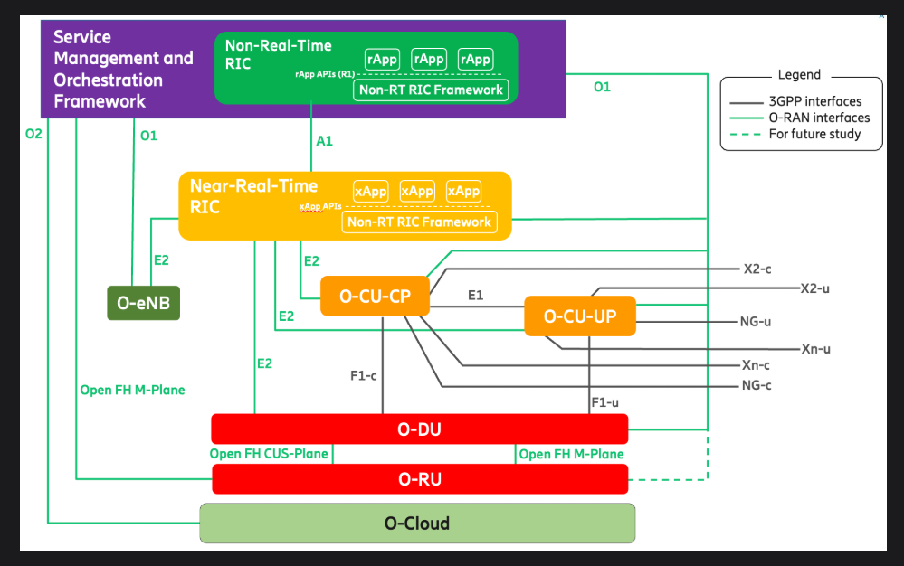
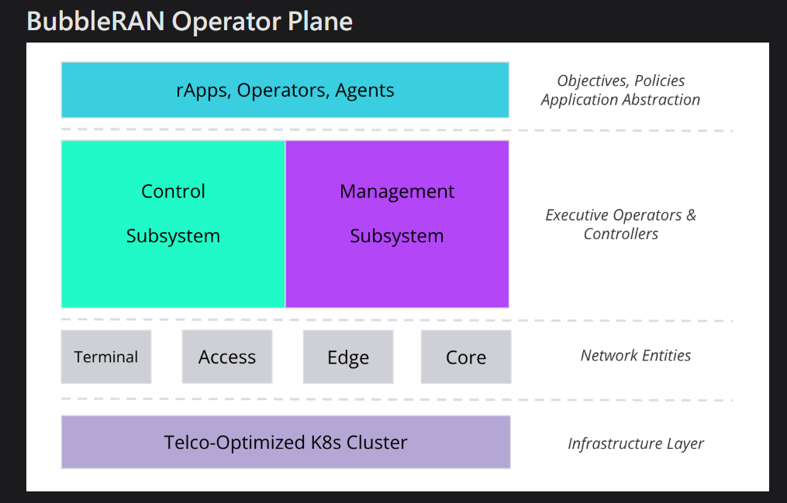
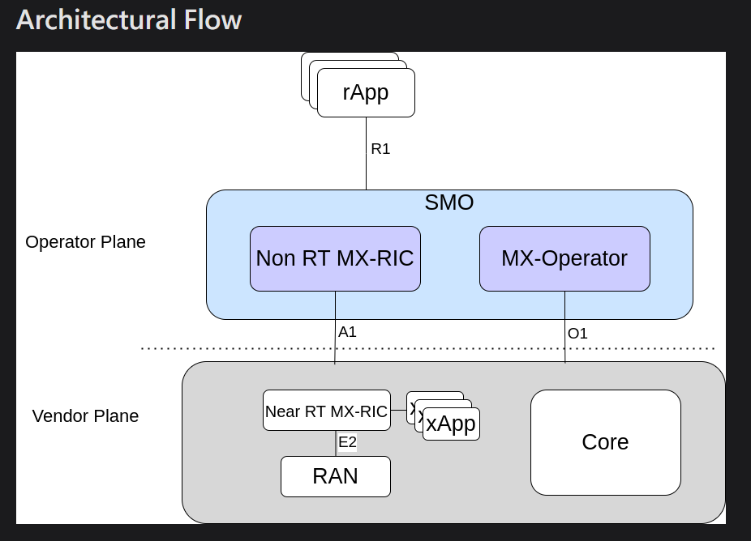

- [BubbleRAN USER guide](#bubbleran-user-guide)
  - [5G Control Plane](#5g-control-plane)
    - [5G SA](#5g-sa)
- [xApp Development Guide](#xapp-development-guide)
  - [xApp Lifecycle](#xapp-lifecycle)
    - [Init](#init)
    - [Indication — Data Subscription \& Handling](#indication--data-subscription--handling)
  - [xApp SDK design](#xapp-sdk-design)
- [rApp Development Guide](#rapp-development-guide)
  - [overview](#overview)
    - [ODIN](#odin)
    - [Operator Plane](#operator-plane)
    - [Core Components](#core-components)
    - [Architectural Flow](#architectural-flow)
  - [ODIN within BubbleRAN’s Ecosystem](#odin-within-bubblerans-ecosystem)

# BubbleRAN USER guide

## 5G Control Plane

| Aspect          | Control Plane (CP)                                | User Plane (UP)           |
| --------------- | ------------------------------------------------- | ------------------------- |
| Function        | Network control, registration, session management | Actual data forwarding    |
| Core Function   | AMF                                               | UPF                       |
| Protocol Layers | NAS, RRC, PDCP, RLC, MAC, PHY                     | SDAP, PDCP, RLC, MAC, PHY |
| Interface       | NG-C                                              | NG-U                      |

- 5G architecture has two modes:
  - **Non-Standalone (NSA)**: Uses LTE for the control plane, relying on the 4G EPC core.
  - **Standalone (SA)**: Fully 5G-based, with both control and user planes on the 5G Core (5GC).

| eng             | full name                         |
| --------------- | --------------------------------- |
| **EPC**         | Evolved Packet Core               |
| **5G-CN / 5GC** | 5G Core Network                   |
| **EN-DC**       | E-UTRA NR Dual Connectivity       |
| **NE-DC**       | NR E-UTRA Dual Connectivity       |
| **NR-DC**       | NR Dual Connectivity              |
| **CUPS**        | Control and User Plane Separation |

### 5G SA

1. Scan and synchronize.
2. Receive MIB (Master Information Blocks) and SIB (System Information Blocks).
3. Cell selection and random access (RACH).
4. RRC connection.
   5 .NAS registration.
5. PDU session establishment.
6. Send/Receive data.

- step 1: Scan and Synchronize

  - At the beginning, there is no dedicated channel for the UE since it is not yet connected.
  - The UE searches for nearby 5G cells and acquires: PSS, SSS to synchronize with gNB timing.

- Step 2：Receive MIB and SIB

  - MIB and SIB messages are generated by the RRC layer, UE must detect MIB and SIB1 before connecting in NR SA.
  - MIB contains reference subcarrier spacing and control channel info.
  - SIB1 provides the necessary information for the initial attach and schedules other SIBs.

- step 3: Cell Selection & Contention-Based Random Access
  - After selecting a 5G cell, the UE performs a Contention-Based Random Access (CBRA) procedure with the gNB, exchanging four key messages (Msg1–Msg4) to establish initial uplink synchronization.

```
 UE → gNB : Msg1 - RA Preamble Transmission
gNB → UE : Msg2 - RA Response
UE → gNB : Msg3 - Scheduled PUSCH Transmission
gNB → UE : Msg4 - Contention Resolution
```

| Message  | Direction | Channel | Content                          | Purpose                               |
| -------- | --------- | ------- | -------------------------------- | ------------------------------------- |
| **Msg1** | UE → gNB  | PRACH   | RA Preamble                      | Start random access                   |
| **Msg2** | gNB → UE  | PDSCH   | TA, RAPID, Uplink Grant, TC-RNTI | Send Random Access Response           |
| **Msg3** | UE → gNB  | PUSCH   | Temp ID, RRC Request             | Send UE ID / connection request       |
| **Msg4** | gNB → UE  | PDSCH   | Contention Resolution            | Confirm UE identity and assign C-RNTI |

- Step 4：RRC Connection
- After completing the random access procedure, the UE establishes an RRC (Radio Resource Control) connection with the gNB.
  This step transitions the UE from IDLE mode to RRC Connected mode, enabling control-plane communication.

```
UE (IDLE) → gNB : RRC Connection Request   //The UE sends an RRC Connection Request message to the gNB containing
gNB → UE : RRC Connection Setup //The gNB responds with RRC Connection Setup, configuring radio parameters, control channels (e.g., SRB/RLC/MAC), and assigning identifiers to the UE.
UE → gNB : RRC Connection Setup Complete   //UE sends RRC Connection Setup Complete to confirm successful setup and may
gNB → UE : RRC Connection Reconfiguration include a NAS message (e.g., Registration Request). //The gNB sends RRC Connection Reconfiguration to modify or enhance configurations (e.g., handover, measurement activation, DRB setup).
The UE replies with RRC Connection Reconfiguration Complete to confirm.
UE → gNB : RRC Connection Reconfiguration Complete
```

- Step 5：NAS Registration

  - After RRC connection, the UE sends a NAS Registration Request to the AMF to register with the 5G network.
  - The message includes the UE’s security credentials and network capabilities.
  - The network performs authentication and security key exchange for secure communication.
  - Once verified, the AMF replies with a Registration Accept, which includes the 5G-GUTI and other configuration details.

- Step 6：PDU Session Establishment

  - To start a data session, the UE sends a PDU Session Establishment Request to the SMF, The message includes session requirements, SSC Mode, and the 5G-GUTI.
  - The SMF processes the request, allocates resources, and replies with a PDU Session Establishment Accept containing QoS parameters and the IP address.

- Step 7：Send/Receive Data
  - After the PDU session is established, the UE can now send and receive data through the 5G network (e.g., internet access, streaming, or voice communication).

# xApp Development Guide

## xApp Lifecycle

| stage          | description                      |
| -------------- | -------------------------------- |
| **Init**       | E42 Setup, E2 State              |
| **Indication** | SM Subscription, Data Collection |
| **Logic**      | Data Analysis, Decision Making   |
| **Control**    | RAN Control, Slicing, RRM        |
| **Exit**       | SM Unsubscribe, E42 Teardown     |


### Init

- The first step of every xApp is to initialize it. This includes:
  1. Parsing the input arguments from folders or files.
  2. Setting up the E42 interface towards FlexRIC
  3. Requesting and reading the current E2 state, which contains the available E2 Nodes and RAN functions

### Indication — Data Subscription & Handling

- In this step, we define how to handle incoming indication messages from the selected elements.
  We write a custom indication callback function to:

1. Process incoming messages
2. Parse desired metrics
3. Store or calculate new values

- To receive indications, the xApp subscribes to the desired E2 Node and RAN function using the proper Service Model (SM).
  During subscription, the xApp provides:

1. The ID(s) of the E2 Node(s)
2. The Service Model ID
3. The reporting interval (e.g., 5 ms)
4. The custom callback function for message handling

- Logic — Core Intelligence Phase
- This is the creative phase of the xApp, where we design the core logic to address a specific use case.
- At this stage, the xApp has already gathered and processed indication messages from E2 Nodes, it is now the ideal time to perform data analysis, extract features, and generate forecasts, turning raw data into actionable insights.

| type                                               | description                                        |
| -------------------------------------------------- | -------------------------------------------------- |
| **Exploratory Data Analysis (EDA)**                | Analyze data distribution and detect anomalies     |
| **Pre-processing & Feature Extraction**            | Clean and extract relevant features                |
| **Forecasting (Supervised/Unsupervised Learning)** | Predict future trends using ML models              |
| **Reinforcement Learning (RL)**                    | Optimize actions based on feedback loops           |
| **Data Set Creation & Augmentation**               | Generate or augment datasets for robustness        |
| **Model Training & Continuous Learning**           | Train models and adapt continuously                |
| **Model Evaluation & Tuning**                      | Evaluate performance and fine-tune hyperparameters |

- Based on data analysis and network observability, the xApp determines the appropriate control actions to apply to the RAN
  to ensure that the network operates closer to the desired state.

## xApp SDK design

- The xApp SDK is designed to be simple yet flexible, enabling efficient xApp development tailored to user needs, and it provides standardized APIs that manage the entire xApp lifecycle.
- Thanks to SWIG, xApps can be developed in multiple languages, including C/C++ and Python.
  The C SDK provides the fundamental functions that manage the xApp lifecycle and Service Models (SM).
  These functions form the backbone of xApp development, supporting innovation and flexibility.
  

- SWIG acts like a translator, allowing different languages ​​(such as Python) to "understand" the functionality provided by the C/C++ SDK.

# rApp Development Guide

## overview



- This figure is O-RAN Architectural

### ODIN

- ODIN is BubbleRAN’s logical controller responsible for controlling Network Functions (NFs).
  Here, “control” means white-box control, where ODIN can access internal logic, read different statistics, and apply different policies.
  Because each NF behaves differently (Core, CU, DU, etc.), ODIN must have deep knowledge of their internal logic to properly configure them based on user requirements.
  When focusing on the Radio Access Network (RAN), ODIN aligns with the role of the Non-Real-Time RIC (Non-RT RIC) in the O-RAN architecture.
- ODIN is essentially BubbleRAN’s version of the Non-Real-Time RIC, providing white-box control, policy management, AI/ML orchestration, and network optimization.

### Operator Plane



- The Operator Plane is BubbleRAN’s cloud-native orchestration and control layer.
- It separates high-level intent (rApps) from low-level execution (xApps & RAN elements) through a layered architecture.
- Layers:
  - rApps / Operators / Agents — intents, policies, AI/ML (BubbleRAN calls it rApps (equivalent to rApps in O-RAN).)
  - Control Subsystem — Non-RT RIC equivalent (odin-control-manager)
  - Management Subsystem — OAM lifecycle management (athena-base-operator)
  - Network Entities — DU, CU, RU, Core
- **All built on a telco-optimized Kubernetes cluster.**

### Core Components

- 1.OAM Component – athena-base-operator
  - The OAM operator (athena-base-operator) handles full lifecycle management of all RAN components and provides foundational models (Network, Element, Composition).
  - OAM = **Operations,** **Administration,** and **Maintenance**
  - OAM is the full set of functions used to operate, administer, and maintain network elements.
- 2.Non-RT RIC Component – odin-control-manager
  - odin-control-manager = **BubbleRAN’s Non-RT RIC**
  - Responsibilities:
    - Acts as the control gateway in the operator plane
    - Provides R1 interface for rApps
    - Interacts with xApps and Near-RT controllers through A1 (Corresponding to O-RAN A1: Policy, Enrichment, Models)
    - Handles orchestration, policy enforcement, and decision dissemination
    - Ensures intent–execution alignment across the RAN (SLA, energy, slicing, load balancing, TDD, etc.)

| O-RAN      | BubbleRAN                        |
| ---------- | -------------------------------- |
| rApp       | rApp                             |
| Non-RT RIC | **ODIN（odin-control-manager）** |
| SMO OAM    | **Athena Operator**              |
| DU/CU/RU   | DU/CU/RU（BubbleRAN containers） |

- We can say that ODIN is BubbleRAN’s Non-RT RIC, translating rApp intents into executable control decisions for DU/CU/RU. Athena Operator handles lifecycle management.

### Architectural Flow



- rApps target drop → ODIN (Non-RT RIC) converted to policy → Near-RT RIC + xApps executed on RAN → Athena Operator performs OAM
  - **rApps:**
    - rApps define high-level objectives and send them to ODIN through the R1 interface.
    - rApps define higher-order objectives (intents), EX: reducing power consumption by 20% or maintaining UE throughput at 50Mbps.
    - rApps do not directly control the RAN.
    - rApps transmit objectives to ODIN through the R1 interface.
  - **Operator Plane（SMO Layer）**
    - ODIN receives intents from rApps, converts them into policies, and sends them to the Near-RT RIC via the A1 interface.
  - **MX-Operator（athena-base-operator）＝ OAM Layer**
    - The MX-Operator provides OAM through the O1 interface, enabling deployment, monitoring, updates, and configuration of RAN elements.
  - **Vendor Plane (Execution Layer)**
    - Near-RT MX-RIC（xApp Orchestrator: The Near-RT RIC orchestrates xApps and performs time-critical RAN control (ms–s scale) via E2.
    - xApps: xApps execute fine-grained control of the RAN over E2.
    - RAN + Core: Actual DU / CU / RU
      Actual core network modules (AMF, SMF, UPF...)

## ODIN within BubbleRAN’s Ecosystem

- **ODIN functions as a Non-RT RIC Orchestrator.**
  - ODIN functions as a Non-RT RIC Orchestrator, providing the central decision-making and orchestration layer in BubbleRAN.
  - ODIN is BubbleRAN’s Non-RT RIC orchestrator. It converts rApp intents into policies, deploys the right xApps, and coordinates execution, without directly controlling or measuring the RAN.
