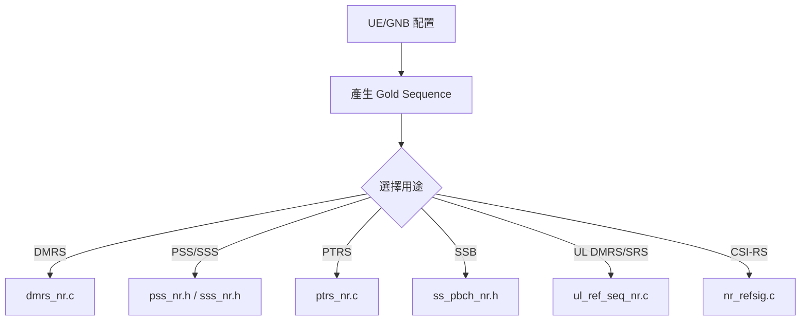
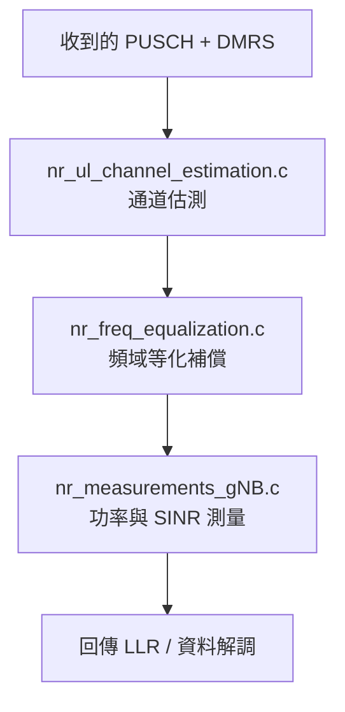

**openair1/PHY/**

| 檔案/資料夾                        | 功能                    |
| ----------------------------- | --------------------- |
| `defs.h`                      | 結構與函式宣告               |
| `vars.h`                      | 變數定義                  |
| `extern.h`                    | 使用其他模組變數時使用 extern 宣告 |
| `spec_defs.h` / `impl_defs.h` | 規格與實作相關的宏定義           |
| `types.h`                     | 自訂資料型別定義              |
```
openair1/
├── PHY/ # 實作所有 PHY 層訊號處理功能（實機與模擬皆用）
├── SCHED/ # eNB 端 PHY 排程處理流程
├── SCHED_UE/ # UE 端 PHY 排程處理流程
├── SCHED_NB_IOT/ # NB-IoT PHY 排程處理
├── SCHED_NR/ # 5G gNB PHY 排程處理
├── SCHED_NR_UE/ # 5G UE PHY 排程處理
├── SIMULATION/ # 提供 PHY 層模擬測試用工具與模擬平台
```


---

##  PHY 子模組說明

| 資料夾 | 功能描述 |
|--------|-----------|
| `CODING/` | 包含 Turbo、Convolutional 編碼器與解碼器、Rate Matching、CRC（對應 TS 36.212） |
| └── `TESTBENCH/` | 各類編碼解碼的單元測試程式 |
| `INIT/` | 初始化 `vars.h` 中的變數，分配記憶體資源 |
| `LTE_ESTIMATION/` | LTE 通道估測實作 |
| `LTE_REFSIG/` | 產生 LTE 參考訊號（PSS/SSS、pilots），對應 TS 36.211 |
| `NR_REFSIG/` | 產生 NR 參考訊號（DMRS、SRS 等），對應 TS 38.211 |
| `LTE_TRANSPORT/` | LTE 傳輸通道實作（PDSCH、PUSCH 等） |
| `LTE_UE_TRANSPORT/` | LTE UE 收發通道處理模組 |
| `NR_TRANSPORT/` | NR gNB 傳輸通道實作 |
| `NR_UE_TRANSPORT/` | NR UE 傳輸通道實作 |
| `NBIoT_TRANSPORT/` | NB-IoT PHY 傳輸通道 |
| `MODULATION/` | 調變與解調（包含 IFFT、FFT、SC-FDMA），對應 TS 36-211 |
| `TOOLS/` | 通用工具，如 FFT、矩陣運算、向量計算等 |
| └── `FFTTEST/` | FFT 測試程式 |

---

##  通用定義檔

| 檔案 | 用途 |
|------|------|
| `defs.h` | 匯總所有子模組的 `defs.h` |
| `vars.h` | 變數定義 |
| `extern.h` | `vars.h` 變數的外部引用 |
| `impl_defs.h` | OpenAir 非 LTE 實作的定義 |
| `spec_defs.h` | LTE/NR 規格相關的定義 |
| `types.h` | 通用資料型別定義 |

---

##  SCHED (排程模組)

###  SCHED/
- `phy_procedures_lte_eNb.c`：eNB 端 PHY 處理（TS 36.213）
- `prach_procedures.c`：隨機接取處理（PRACH）
- `fapi_l1.c`：與 MAC 層的 FAPI 接口
- `phy_mac_stub.c`：提供 PHY-only 模式下的 MAC stub

###  SCHED_UE/
- `phy_procedures_lte_ue.c`：UE 端的 PHY 處理流程
- `pucch_pc.c / pusch_pc.c / srs_pc.c`：功率控制模組

###  SCHED_NR/、SCHED_NR_UE/
- 5G NR gNB 與 UE 對應的 PHY 排程模組

---

##  SIMULATION 測試模組

###  SIMULATION/LTE_PHY/
| 測試檔 | 功能 |
|--------|------|
| `pbchsim.c` | 廣播通道模擬（PBCH） |
| `pdcchsim.c` | 控制通道模擬（DCI） |
| `dlsim.c` | 下行共享通道模擬（PDSCH） |
| `ulsim.c` | 上行共享通道模擬（PUSCH） |
| `pucchsim.c` | 上行控制通道模擬（PUCCH） |

###  SIMULATION/RF/
- 模擬射頻（RF）收發行為，含通道模擬

---

##  實機 vs 模擬變數定義方式

- 在真實系統（如 `lte-softmodem.c`）中，變數僅定義一次。
- 若其他模組需引用該變數，應透過 `extern.h`。

---

##  對應 3GPP 規範

| 模組 | 對應規範 |
|------|----------|
| `CODING/` | TS 36.212 / TS 38.212 |
| `MODULATION/` | TS 36.211 / TS 38.211 |
| `TRANSPORT/` | TS 36.211 + TS 36.212 / TS 38.211 + TS 38.212 |
| `SCHED/` | TS 36.213 / TS 38.213 |

---

>  若你需要針對某個功能（例如 PUSCH 解調或 FFT/IFFT）進一步找函式與檔案位置，也可以再指定，我會幫你標記程式碼入口點。


#  OAI PHY 層 Header 檔案清單與功能（openair1/PHY/*.h）

這些 `.h` 標頭檔主要提供結構、常數、變數與函式的宣告，配合 `.c` 實作檔組成 OAI Layer 1 的模組。

---

##  defs_*.h 系列：模組定義與結構

| 檔案名稱 | 功能摘要 |
|----------|-----------|
| `defs_L1_NB_IoT.h` | NB-IoT Layer 1 定義 |
| `defs_RU.h` | Remote Unit（O-RU）相關定義 |
| `defs_UE.h` | LTE UE 的 PHY 層定義 |
| `defs_common.h` | 4G/5G 通用定義（不含 NR 特有內容） |
| `defs_eNB.h` | LTE eNB 的處理程序定義 |
| `defs_gNB.h` | 5G gNB 的定義（含 beamforming 等） |
| `defs_nr_UE.h` | 5G NR UE 的 PHY 定義（如 TX 時間預算） |
| `defs_nr_common.h` | 5G NR 共通部分定義 |
| `defs_nr_slUE.h` | Sidelink UE 定義（含 PSBCH） |

---

##  impl_defs_*.h 系列：實作相關宏定義（implementation macros）

| 檔案名稱 | 功能摘要 |
|----------|-----------|
| `impl_defs_lte_NB_IoT.h` | NB-IoT LTE 實作相關定義 |
| `impl_defs_nr.h` | NR 實作層宏定義（如 EPRE 計算） |
| `impl_defs_top.h` | 上層共通實作定義 |
| `impl_defs_top_NB_IoT.h` | NB-IoT 上層定義 |

---

##  extern.h 系列：跨模組變數 extern 宣告

| 檔案名稱 | 功能摘要 |
|----------|-----------|
| `phy_extern.h` | 所有模組共用的 PHY 層變數 extern 宣告 |
| `phy_extern_nr_ue.h` | 5G NR UE 專屬 extern 宣告 |
| `phy_extern_ue.h` | LTE UE 專用 extern 宣告 |

---

##  vars.h 系列：變數定義（與 extern 對應）

| 檔案名稱 | 功能摘要 |
|----------|-----------|
| `phy_vars.h` | 共用 PHY 變數定義 |
| `phy_vars_nr_ue.h` | NR UE 專用變數定義 |
| `phy_vars_ue.h` | LTE UE 專用變數定義 |

---

##  其他功能檔案

| 檔案名稱 | 功能摘要 |
|----------|-----------|
| `sse_intrin.h` | SSE 指令集相關單元測試與優化支援 |

---

##  注意事項

- `defs_*.h` 通常用於結構宣告與模組函式 interface。
- `phy_vars*.h` 實際定義全域變數，對應的 `phy_extern*.h` 提供 extern 宣告。
- `impl_defs*.h` 提供條件編譯（例如 LTE vs NR vs NB-IoT）時所需的巨集定義。

---

> 若你要了解某個 `.h` 檔案對應到的 `.c` 功能（例如 `defs_nr_UE.h` 會配合哪幾個檔案處理 uplink），我可以幫你標出具體來源與範例程式碼。

#  OAI 5G NR 參考訊號模組整理（PHY/NR_REFSIG）

此模組處理 NR PHY 中的各類參考訊號產生、對齊與映射，支援 DMRS、PSS、SSS、PTRS、SSB 等功能。

---

##  檔案功能總覽

| 檔案名稱 | 類型 | 功能描述 |
|----------|------|-----------|
| `dmrs_nr.c` | `.c` | DMRS 接收與處理主程式（解碼與頻域對齊） |
| `dmrs_nr.h` | `.h` | 定義 NR DMRS 結構與常數 |
| `nr_dmrs_rx.c` | `.c` | 計算 DMRS EPRE 比例（與 PUSCH 能量對應） |
| `nr_gen_mod_table.c` | `.c` | 調變查找表（Modulation LUT）生成邏輯 |
| `nr_gen_mod_table.m` | `.m` | Octave script，用於生成調變表（測試用途） |
| `nr_gold_ue.c` | `.c` | UE 端 Gold 序列產生器（PRACH、DMRS、SSS 使用） |
| `nr_mod_table.h` | `.h` | QPSK/16QAM/64QAM/256QAM LUT 的 header |
| `nr_refsig.c` | `.c` | 通用 reference signal 生成介面（包含 CSI-RS） |
| `nr_refsig.h` | `.h` | 對應 `.c` 檔的函式原型與宣告 |
| `nr_refsig_common.h` | `.h` | 公用的 Gold Cache 儲存、載入 |
| `pss_nr.h` | `.h` | PSS（Primary Sync Signal）參考訊號常數定義 |
| `ptrs_nr.c` | `.c` | PTRS（Phase Tracking RS）生成與插入邏輯 |
| `ptrs_nr.h` | `.h` | 定義 PTRS 對應結構與接口 |
| `refsig.c` | `.c` | 與 Gold Cache 加速有關的函式實作 |
| `refsig_defs_ue.h` | `.h` | UE 端參考訊號函式定義 |
| `ss_pbch_nr.h` | `.h` | 定義 SSB + PBCH 的 Sidelink 同步參考訊號 |
| `sss_nr.h` | `.h` | SSS（Secondary Sync Signal）掃描與比對常數 |
| `ul_ref_seq_nr.c` | `.c` | 上行 DMRS/SRS/PRACH 等參考序列管理 |
| `ul_ref_seq_nr.h` | `.h` | 上行 reference signal 宣告與定義 |

---

## 主要功能模組分類

###  同步訊號（Synchronization Signals）
- `pss_nr.h`, `sss_nr.h`, `ss_pbch_nr.h`: 用於初始小區搜尋（SSB）

###  解調參考訊號（DMRS）
- `dmrs_nr.c`, `nr_dmrs_rx.c`: PUSCH/PDSCH 的解調參考符號
- `nr_refsig.c`, `nr_refsig.h`: 生成不同型態的 reference signals

### 相位追蹤參考符號（PTRS）
- `ptrs_nr.c`, `ptrs_nr.h`: 用於頻率偏移補償（e.g. for high-Doppler）

###  Gold 序列產生器
- `nr_gold_ue.c`, `nr_refsig_common.h`: 快速產生 PRS, DMRS 等 pseudorandom sequences

###  測試與查找表
- `nr_gen_mod_table.c/.m`, `nr_mod_table.h`: 產生並測試 modulation LUT
- `refsig.c`, `refsig_defs_ue.h`: 加速解碼與金序列快取管理

---

##  實作對應流程（範例）


#  OAI 調變與 OFDM 前端模組總覽（openair1/PHY/MODULATION/）

此資料夾處理調變（modulation/demodulation）與 OFDM 前端流程（如 IFFT、CP 插入、Slot 處理等），涵蓋 4G LTE 與 5G NR。

---

##  檔案功能對照表

| 檔案名稱 | 功能分類 | 描述 |
|----------|----------|------|
| `nr_modulation.c` | NR 調變 | 5G NR 調變器主程式（QPSK、16QAM、64QAM、256QAM） |
| `nr_modulation.h` | NR 調變 | 對應的函式宣告與常數定義 |
| `modulation_common.h` | 共用定義 | NR UE 中使用的共通調變常數 |
| `modulation_UE.h` | LTE UE 調變 | LTE UE 調變流程控制結構 |
| `modulation_eNB.h` | LTE eNB 調變 | LTE eNB 調變流程控制結構 |
| `modulation_extern.h` | extern 宣告 | 調變模組中使用的 extern 函式與變數宣告 |

---

##  OFDM 與前端處理模組

| 檔案名稱 | 功能分類 | 描述 |
|----------|----------|------|
| `ofdm_mod.c` | OFDM 調變 | 包含 FFT/IFFT 實作、CP 插入邏輯（NR/LTE 通用） |
| `slot_fep.c` | Slot FEP | LTE slot 前端處理（接收端用，做 FFT 等） |
| `slot_fep_mbsfn.c` | Slot FEP | MBSFN 專用 slot 前處理 |
| `slot_fep_nr.c` | Slot FEP (NR) | 5G NR slot 的接收前處理（FFT、SC-FDMA 處理等） |
| `slot_fep_ul.c` | Slot FEP (UL) | 上行 LTE slot 處理邏輯 |
| `beamforming.c` | Beamforming | 陣列天線波束形成處理（數位 beamforming） |
| `compute_bf_weights.c` | Beamforming | 計算 beamforming 權重的實作邏輯 |

---

##  測試與特殊功能

| 檔案名稱 | 描述 |
|----------|------|
| `gen_75KHz.cpp` | 用於生成特定頻率偏移測試訊號 |
| `ul_7_5_kHz.c` | 處理 uplink 中的 7.5kHz 偏移（如 PRACH） |
| `ul_7_5_kHz_ue.c` | UE 端使用的 7.5kHz 偏移對應處理 |

---

##  主要功能流程簡圖（以 5G NR 上行為例）

```
graph TD
  A[Encoded Codewords] --> B[nr_modulation.c<br>QAM Mapping]
  B --> C[Resource Mapping]
  C --> D[OFDM IFFT + CP 插入<br>(ofdm_mod.c)]
  D --> E[Slot 封裝<br>(slot_fep_nr.c)]
  E --> F[送往 RF 或通道模擬器]

```
#  OAI 5G NR 通道估測模組整理（PHY/NR_ESTIMATION/）

此模組實作了 5G NR 上行接收端的通道估測、頻域均衡與功率量測等處理步驟，主要用於 gNB 接收端的 PHY 層。

---

##  檔案總覽與功能說明

| 檔案名稱 | 類型 | 功能描述 |
|----------|------|-----------|
| `nr_ul_channel_estimation.c` | `.c` | 上行 DMRS-based 通道估測主程式（核心演算法） |
| `nr_freq_equalization.c` | `.c` | 接收端的頻域均衡（Equalization）處理 |
| `nr_measurements_gNB.c` | `.c` | 進行通道功率、SINR、RSRP 等測量指標 |
| `nr_ul_estimation.h` | `.h` | 所有相關函式的宣告與結構定義 |

---

##  主要處理流程（以 gNB 上行接收為例）


#  OAI 5G NR PHY 傳輸模組：檔案功能總覽（openair1/PHY/NR_TRANSPORT）

此模組涵蓋上行/下行共享通道（ULSCH/DLSCH）、隨機接入（PRACH）、同步（PSS/SSS）、DCI、Scrambling 等功能，是 NR PHY 接收與發送處理的核心。

---

##  DCI 控制通道模組

| 檔案 | 功能描述 |
|------|----------|
| `nr_dci.c` | 實作 DCI 的解碼與處理，包括 Beamforming 對應 |
| `nr_dci.h` | 宣告與 Beam 配置有關的 DCI 結構與常數 |
| `nr_dci_tools.c` | 提供 DCI 的 trace 工具與 MAC→PHY 結構轉換邏輯 |

---

##  DLSCH 下行共享通道模組

| 檔案 | 功能描述 |
|------|----------|
| `nr_dlsch.c` | 下行 PDSCH 資料的接收與處理流程 |
| `nr_dlsch.h` | 定義下行 L1 DLSCH 的資料結構與常數 |
| `nr_dlsch_coding.c` | 負責 DLSCH 的 LDPC 解碼輸出與 TB 還原 |
| `nr_dlsch_tools.c` | 輔助工具函式（例如資源分配與 memory layout） |

---

##  廣播通道

| 檔案 | 功能描述 |
|------|----------|
| `nr_pbch.c` | 接收與解調 PBCH（主系統資訊廣播）並做 QPSK 映射表對應 |

---

##  隨機接入（PRACH）

| 檔案 | 功能描述 |
|------|----------|
| `nr_prach.c` | 接收 PRACH（隨機接入）訊號並進行解析（包含 fill_prach_ru） |
| `nr_prach.h` | PRACH 處理過程的資料結構與函式宣告 |
| `nr_prach_common.c` | 提供 PRACH Root Sequence 計算與通用處理邏輯 |

---

##  參考與同步信號（PRS / PSS / SSS）

| 檔案 | 功能描述 |
|------|----------|
| `nr_prs.c` | PRS（定位輔助訊號）處理（尚未完整實作） |
| `nr_pss.c` | PSS（Primary Sync Signal）產生與初始小區 ID 偵測 |
| `nr_sss.c` | SSS（Secondary Sync Signal）解碼與小區識別碼推導 |

---

##  DMRS 與調變輔助模組

| 檔案 | 功能描述 |
|------|----------|
| `nr_sch_dmrs.c` | DMRS 對應與 Layer Mapping、PUSCH 解調前處理 |
| `nr_sch_dmrs.h` | 定義與 NR DMRS Layer Mapping 有關的結構 |

---

##  Scrambling 與 LLR 工具

| 檔案 | 功能描述 |
|------|----------|
| `nr_scrambling.c` | NR scrambling 與 descrambling 實作，使用 SIMD 加速（XOR） |

---

##  TBS 與傳輸工具

| 檔案 | 功能描述 |
|------|----------|
| `nr_tbs_tools.c` | 計算 TBS（Transport Block Size）與解碼參數查表邏輯 |
| `nr_transport_common_proto.h` | 定義共用傳輸原型與內部介面協定 |

---

##  傳輸協定定義檔

| 檔案名稱 | 功能描述 |
|----------|-----------|
| `nr_transport_common_proto.h` | 定義共用傳輸原型，例如 PUSCH/PDCCH/PUSCH interface |
| `nr_transport_proto.h` | 定義更高層與 PHY 層之間的傳輸協議與資料結構 |

---

##  UCI 工具模組

| 檔案名稱 | 功能描述 |
|----------|-----------|
| `nr_uci_tools_common.c` | 處理 UCI（Uplink Control Information）格式與管理，如 HARQ-ACK、SR 等 |

---

##  ULSCH 上行共享通道模組

| 檔案名稱 | 功能描述 |
|----------|-----------|
| `nr_ulsch.c` | 控制整個 ULSCH 接收處理流程（入口點） |
| `nr_ulsch.h` | 定義 ULSCH 處理用的資料結構與函式接口 |
| `nr_ulsch_decoding.c` | ULSCH 的 LDPC 解碼器實作 |
| `nr_ulsch_demodulation.c` | 處理接收符號的通道補償與等化（MMSE/ZF） |
| `nr_ulsch_llr_computation.c` | 計算 LLR 值並傳給 LDPC 解碼器做 soft-decoding |

---

##  上行控制訊號接收器

| 檔案名稱 | 功能描述 |
|----------|-----------|
| `pucch_rx.c` | 接收並解碼 UE 傳送的 PUCCH（Uplink Control Channel）訊號 |
| `srs_rx.c` | 接收 UE 傳送的 SRS（Sounding Reference Signal）用於上行通道品質量測 |

---

##  上行接收鏈統整流程圖（含控制資訊）

```
graph TD
  A[接收 RF 波形] --> B[slot_fep_nr.c (FFT)]
  B --> C[nr_ul_channel_estimation.c]
  C --> D[nr_ulsch_demodulation.c: 等化]
  D --> E[nr_ulsch_llr_computation.c: LLR 計算]
  E --> F[nr_ulsch_decoding.c: LDPC 解碼]
  F --> G[成功還原傳輸區塊（TB）]

  B --> H[pucch_rx.c: 控制資訊解析]
  B --> I[srs_rx.c: 頻道響應量測]

  B --> J[nr_uci_tools_common.c: SR/ACK 組合]

```
#  OAI PHY 層初始化模組整理（openair1/PHY/INIT）

此模組負責設定 LTE / NR 的 PHY 結構，包括 frame 參數、buffer 配置、beamforming、FFT 表格等，為收發鏈啟動做準備。

---

##  檔案功能對照表

| 檔案名稱 | 系統別 | 功能說明 |
|----------|--------|----------|
| `init_top.c` | 共通 | 初始化全域變數、FFT 表、通用 buffer 結構等 |
| `lte_init.c` | LTE | 初始化 LTE PHY 層，建立 DLSCH/ULSCH RX/TX 緩衝區 |
| `lte_init_ru.c` | LTE | RU 模式下的 LTE 初始化（如天線端口） |
| `lte_init_ue.c` | LTE | LTE UE 端初始化 |
| `lte_param_init.c` | LTE | 單元模擬（simulation）用，設定全域 eNB/UE 結構 |
| `lte_parms.c` | LTE | 建立 `init_frame_parms()` 結構，定義 FFT/slot 資訊等 |
| `nr_init.c` | NR | 初始化 NR 系統（支援 analog beamforming extension） |
| `nr_init_ru.c` | NR | NR RU 端初始化（天線數、記憶體分配） |
| `nr_init_ue.c` | NR | NR UE 端初始化，包含 buffer 建立與前處理變數 |
| `nr_parms.c` | NR | 初始化 NR 頻帶（band），對應 3GPP Rel.17 頻段 |
| `defs_NB_IoT.h` | NB-IoT | NB-IoT 的定義檔，僅用於早期版本 |
| `nr_phy_init.h` | NR | 處理 UE 端的 Timing Advance（TA） offset 計算 |
| `phy_init.h` | 共通 | 含 `processSlotTx` 等啟動前判斷邏輯 |

---

##  關鍵初始化流程說明

### LTE 系統初始化（eNB / UE）


- 

- 

- 


