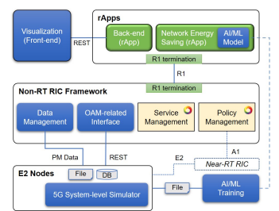
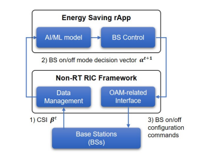
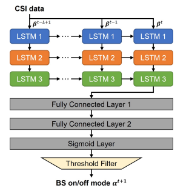

- [An Open RAN Development Framework with Network Energy Saving rApp Implementation](#an-open-ran-development-framework-with-network-energy-saving-rapp-implementation)
  - [Introduction](#introduction)
    - [RICs and Applications](#rics-and-applications)
    - [Framework Requirements](#framework-requirements)
    - [Problem \& Solution](#problem--solution)
    - [Main Contributions](#main-contributions)
  - [OPEN RAN Introduce](#open-ran-introduce)
  - [OPEN RAN DEVELOPMENT FRAMEWORK](#open-ran-development-framework)
    - [Framework Components](#framework-components)
    - [Framework Implementation](#framework-implementation)
      - [I. Implementation Environment and Design Principles](#i-implementation-environment-and-design-principles)
      - [II. Non-RT RIC Framework Component Implementation](#ii-non-rt-ric-framework-component-implementation)
  - [AI/ML-BASED NETWORK ENERGY SAVING](#aiml-based-network-energy-saving)
    - [A. Network Energy Saving Scenario](#a-network-energy-saving-scenario)
    - [B. AI/ML-based Network Energy Saving Process](#b-aiml-based-network-energy-saving-process)
    - [C. Key Definitions and Metrics](#c-key-definitions-and-metrics)
    - [Mathematical Equations:](#mathematical-equations)
    - [AI/ML Model Design](#aiml-model-design)
      - [LSTM-Based BS On/Off Decision Model (Follow Fig. 4 Flow)](#lstm-based-bs-onoff-decision-model-follow-fig-4-flow)
        - [1. Input: CSI data sequence](#1-input-csi-data-sequence)
        - [2. Three-Stacked LSTM Layers](#2-three-stacked-lstm-layers)
          - [2.1 Temporal processing along time](#21-temporal-processing-along-time)
          - [2.2 Vertical stacking of LSTM layers](#22-vertical-stacking-of-lstm-layers)
        - [3. Fully Connected Layers](#3-fully-connected-layers)
          - [3.1 Fully Connected Layer 1](#31-fully-connected-layer-1)
          - [3.2 Fully Connected Layer 2](#32-fully-connected-layer-2)
        - [4. Sigmoid Layer](#4-sigmoid-layer)
        - [5. Threshold Filter](#5-threshold-filter)
        - [6. Final Output: BS on/off mode (\\alpha^{t+1})](#6-final-output-bs-onoff-mode-alphat1)
        - [7. Summary of the Flow (Matching the Figure)](#7-summary-of-the-flow-matching-the-figure)
    - [Generation of Training and Test Datasets](#generation-of-training-and-test-datasets)
      - [1. RAN Simulation Environment](#1-ran-simulation-environment)
      - [2. Obtaining Optimal On/Off Labels](#2-obtaining-optimal-onoff-labels)
      - [3. Avoiding Frequent BS Switching](#3-avoiding-frequent-bs-switching)
      - [4. Dataset Size](#4-dataset-size)
    - [Table I. Performance of Network Energy Saving](#table-i-performance-of-network-energy-saving)
      - [Interpretation of Table I](#interpretation-of-table-i)
        - [• All-on](#-all-on)
        - [• 1-off / 2-off / 3-off](#-1-off--2-off--3-off)
        - [• Proposed (LSTM model)](#-proposed-lstm-model)
        - [• Optimal](#-optimal)
    - [Summary](#summary)
  - [Performance Evaluation](#performance-evaluation)
    - [1. Prediction Accuracy of BS On/Off Decisions](#1-prediction-accuracy-of-bs-onoff-decisions)
    - [2. Network Energy Saving Performance](#2-network-energy-saving-performance)
    - [3. Key Observations from Table I](#3-key-observations-from-table-i)
      - [• Proposed vs All-on](#-proposed-vs-all-on)
      - [• Proposed vs n-off](#-proposed-vs-n-off)
      - [• Proposed vs Optimal](#-proposed-vs-optimal)
    - [4. Summary of Performance Evaluation](#4-summary-of-performance-evaluation)

# An Open RAN Development Framework with Network Energy Saving rApp Implementation

| Section                        | Points                                                                                                                                                                                         |
| :----------------------------- | :--------------------------------------------------------------------------------------------------------------------------------------------------------------------------------------------- |
| **I. Research Goal**           | The main objective is to design and develop an Open RAN framework to efficiently support the **implementation and testing of rApp prototypes**.                                                |
| **II. Framework Focus**        | The framework specifically provides the functionalities of the **Non-RT RIC** and a simplified **O1 interface** with E2 Node functions for 5G RAN simulation and **dataset generation**.       |
| **III. rApp Implementation**   | To validate the framework, an **rApp prototype** was implemented to support the crucial **network energy saving feature**.                                                                     |
| **IV. Intelligence Basis**     | This rApp utilizes an **Artificial Intelligence/Machine Learning (AI/ML) model** to perform its intelligent control within the Open RAN system.                                                |
| **V. Validation & Conclusion** | Validation was done via a **conformance test** and verification of efficiency through **visualization results**. The framework is proven to be **extensible** to a variety of O-RAN use cases. |

## Introduction

### RICs and Applications

- rApp, xApp, and dApp are the core applications providing intelligence for network management. Non-RT RIC is a logical function that provides rApps with performance data and enables long-term RAN network control in the management layer.

### Framework Requirements

- An efficient and flexible development framework is required to develop rApps, featuring: Non-RT RIC functionalities (registration, E2 Node control); support for measurement information (logged from RAN nodes); and visualization (GUI) for debugging and performance comparison.

### Problem & Solution

- Intelligence is a key feature. The paper addresses network energy saving, a complex problem with conflicting goals (performance vs. energy). The solution is a data-driven rApp leveraging AI/ML models.

### Main Contributions

- 1. Propose an Open RAN development framework with a lightweight and flexible Non-RT RIC architecture. 2. Design and implement an AI/ML-based network energy saving rApp. 3. Validate the framework by testing the rApp operation through a visualization environment.

## OPEN RAN Introduce

| Component                                      | Definition                                                                                                                                                                                                       |
| :--------------------------------------------- | :--------------------------------------------------------------------------------------------------------------------------------------------------------------------------------------------------------------- |
| **Service Management and Orchestration (SMO)** | Management entity which performs management, orchestration, and **automation** of Open RAN systems.                                                                                                              |
| **Non-RT RIC**                                 | **Non-real-time** management functionality which is comprised of **rApps** and **Non-RT RIC Framework**.                                                                                                         |
| **rApps**                                      | Applications that provide various **Non-RT RIC services** for performance management and enhancement.                                                                                                            |
| **Non-RT RIC Framework**                       | A framework internal to **SMO** that is connected to **rApp** via **R1 interface**, and includes Service Management & Exposure, Data Management & Exposure, and **A1 Policy/enrichment information Management**. |
| **Near-real-time RIC (Near-RT RIC)**           | **Near-real-time** management functionality composed of **xApps** and **Near-RT RIC Platform** that directly handles Open RAN Network Functions.                                                                 |
| **xApps**                                      | Applications that provide various **Near-RT RIC operations** for radio resource management, such as RAN control and RAN data analysis.                                                                           |
| **Near-RT RIC Platform**                       | A platform that includes the terminations of **E2, A1, and O1 interfaces**, and the components needed to run and manage xApps.                                                                                   |
| **E2 Nodes**                                   | O-RAN managed functions which include **O-Central Unit (CU)-Control Plane (CP)/User Plane (UP), O-Distributed Unit (DU)**.                                                                                       |
| **O-Cloud**                                    | A cloud computing platform for Open RAN entities, with management and orchestration capabilities in the form of **virtualization infrastructure**.                                                               |

## OPEN RAN DEVELOPMENT FRAMEWORK

### Framework Components

| Component | Definition |
| :--- | :--- |
| **Non-RT RIC Framework** | This component provides **R1 service functions** to rApps and includes **service management, data management, policy management**, and **OAM-related service functions**. |
| **rApps** | This refers to the applications (including the **Network Energy Saving rApp**) that provide various services by connecting to the Non-RT RIC Framework through **R1 termination**. |
| **E2 Nodes** | This component provides a variety of **RAN information and performance data** through system-level simulation. It also **generates the datasets for AI/ML model development**. |
| **Visualization (Front-end)** | This component provides a **GUI (Graphical User Interface)** for Open RAN system monitoring and management. |
| **AI/ML Model / Training** | The core intelligence component used by the rApp to determine **cell on/off** status by monitoring performance data. It is trained using datasets generated by the E2 Nodes. |

### Framework Implementation

#### I. Implementation Environment and Design Principles

| Category                  | Points                                                                                                                      |
| :------------------------ | :-------------------------------------------------------------------------------------------------------------------------- |
| **Operating Environment** | The implemented framework and rApps run on **Ubuntu 22.04**, and each image runs as a **Docker container**.                 |
| **O-RAN Compliance**      | **OSC (O-RAN Software Community) Non-RT RIC (Release I)** is adopted for Service Management and Policy Management.          |
| **Design Simplification** | The framework is implemented as **simply and lightly as possible** to efficiently support the rApp development environment. |

#### II. Non-RT RIC Framework Component Implementation

| Component                 | Definition                                                                                                                                                                    |
| :------------------------ | :---------------------------------------------------------------------------------------------------------------------------------------------------------------------------- |
| **Service Management**    | **OSC rApp Catalogue** and **Common API Framework (CAPIF)** are used for **rApp/service registration and exposure**.                                                          |
| **Policy Management**     | **OSC A1 Policy Management System** and Control Panel are used for **A1 policy handling**.                                                                                    |
| **Data Management**       | This component is responsible for **performance data delivery to rApps via R1 interface**. (Implemented using **CSV files/InfluxDB database** instead of O1 interface).       |
| **OAM-related Interface** | Supports **Configuration Management (CM)** and **Fault Management (FM)** services to control **E2 Nodes**, e.g., cell on/off. (Constructed based on the simple **REST API**). |

- OAM: Operations, Administration, and Maintenance. Refers to the set of functions required for maintaining the network. Includes CM and FM.
- CM / FM: Configuration Management / Fault Management. Specific services within OAM. CM is used to configure RAN functions (e.g., cell on/off).
- CAPIF: Common API Framework. A standardized framework that enables the discovery and exposure of services/APIs across different applications.
- REST API: Representational State Transfer API. A software architectural style used for creating web services. Often used for its simplicity in data exchange (like OAM commands).

## AI/ML-BASED NETWORK ENERGY SAVING

### A. Network Energy Saving Scenario

| Topic                 | Points                                                                                                                                                                                                                                                    |
| :-------------------- | :-------------------------------------------------------------------------------------------------------------------------------------------------------------------------------------------------------------------------------------------------------- |
| **Problem**           | Mobile network costs and energy consumption have increased dramatically. Existing methods struggle because mobile traffic and environments change over time, making it difficult to balance conflicting goals: **network performance vs. energy saving**. |
| **Proposed Solution** | The work proposes an **AI/ML-based approach**, which is a **data-driven learning technique**. The goal is to learn when to turn BSs on/off while ensuring network performance **without severely compromising user experience**.                          |
| **Deployment**        | The energy saving process is implemented by leveraging a **cell switch on/off framework** in the **Non-RT RIC deployment**.                                                                                                                               |

### B. AI/ML-based Network Energy Saving Process

| Step                              | Description                                                                                                                                      |
| :-------------------------------- | :----------------------------------------------------------------------------------------------------------------------------------------------- |
| **1. Data Collection**            | The Base Stations (**BSs**) send the collected **Channel State Information ($CSI, \beta^t$)** to the **Non-RT RIC Framework (Data Management)**. |
| **2. Decision Vector Generation** | Using the CSI data, the **Energy Saving AI/ML model** generates the **BS on/off mode decision vector ($\alpha^{t+1}$)** for the next time slot.  |
| **3. Control Command**            | The **Non-RT RIC Framework (OAM-related Interface)** uses this vector to send **on/off configuration commands** to the BSs.                      |

### C. Key Definitions and Metrics

| Term                                       | Definition                                                                                                                                                                      |
| :----------------------------------------- | :------------------------------------------------------------------------------------------------------------------------------------------------------------------------------ |
| **BS on/off mode ($\alpha^t$)**            | A **binary vector** where $\alpha_m^t$ is set to $1$ if the $m$-th BS is active, otherwise it is set to $0$. This is the output of the AI model.                                |
| **Channel State Info ($\beta^t$)**         | Used to represent CSI, specifically the **large-scale fading coefficient**. This is the key input for the AI/ML model.                                                          |
| **Ergodic Achievable Data Rate ($R_k^t$)** | The performance metric for the $k$-th UE, calculated based on SINR. **This must be maintained above a threshold.**                                                              |
| **BS Power Consumption ($P_m^t$)**         | The energy consumption model defined by the **transmission power ($P_{m}^{tx, t}$)** and the **maintenance power ($P_{m}^{mode, t}$)**. **This is the metric to be minimized.** |

### Mathematical Equations:

**1. Ergodic Achievable Data Rate ($R_k^t$):**

$$R_k^t = \log_2 \left( 1 + \frac{\beta_{k k}^t P_{k k}^t}{\sum_{j \neq k}^K \sum_{i=1}^M \alpha_i^t \beta_{k i}^t P_{i j}^t + \sigma_n^2} \right), \quad \text{where } \alpha_i^t \in \{0, 1\}$$

**2. BS Power Consumption Model ($P_m^t$):**

$$P_m^t = P_m^{tx, t} + P_m^{mode, t}$$

### AI/ML Model Design

| Aspect                         | Explanation                                                                                                                                                                            |
| :----------------------------- | :------------------------------------------------------------------------------------------------------------------------------------------------------------------------------------- |
| **Model Type**                 | The architecture is a proposed **LSTM-based neural network**. **Long Short-Term Memory (LSTM)** is used to manage **time-sequential data** and extract temporally correlated features. |
| **Input**                      | The input is a sequence of past CSI data: $\{\beta^{t-L+1}, \dots, \beta^{t}\}$. The sequence length $L$ and hidden state size are set to **5 and 256**, respectively.                 |
| **I. LSTM Layers**             | The input is processed by **three-stacked LSTMs**. These layers learn the dynamics and historical patterns of the channel conditions.                                                  |
| **II. Fully Connected Layers** | The output of the last LSTM cell passes through **two-stacked fully connected layers**. These layers map the extracted temporal features to the final decision space.                  |
| **III. Sigmoid Layer**         | The output passes through a **Sigmoid Layer**, yielding an **$M$-dimensional vector** with values between 0 and 1.                                                                     |
| **IV. Threshold Filter**       | The Sigmoid output is connected to a **Threshold Filter**. Any value greater than the threshold ($\tau = 0.5$) is set to **1 (ON)**, and otherwise set to **0 (OFF)**.                 |
| **Output**                     | The filter outputs the final **BS on/off mode decisions $\boldsymbol{\alpha}^{t+1}$** for the next time slot.                                                                          |

#### LSTM-Based BS On/Off Decision Model (Follow Fig. 4 Flow)

##### 1. Input: CSI data sequence

- We consider a sequence of **past CSI data**:
  - \( \beta^{t-L+1}, \beta^{t-L+2}, \ldots, \beta^{t-1}, \beta^{t} \)
- This CSI sequence represents the **channel condition history** observed by each base station (BS) over the last \(L\) time slots.
- The goal is to use this history to decide the **BS on/off mode** for the next time slot.

---

##### 2. Three-Stacked LSTM Layers

The CSI sequence is fed into **three stacked LSTM layers** (LSTM 1, LSTM 2, LSTM 3), as shown in the figure.

###### 2.1 Temporal processing along time

- For each time step in the sequence  
  \( t-L+1, \ldots, t-1, t \),
  the corresponding CSI vector \( \beta^{\tau} \) is used as input.
- The LSTMs process the sequence **from left to right**, capturing:
  - Short-term variations (recent CSI changes)
  - Long-term dependencies (overall traffic and channel trends)

###### 2.2 Vertical stacking of LSTM layers

- **LSTM 1** (top row, blue blocks):
  - First layer that directly receives the CSI sequence.
  - Extracts primary temporal features from the raw CSI.
- **LSTM 2** (middle row, orange blocks):
  - Takes the hidden states from LSTM 1 as input.
  - Learns higher-level temporal patterns.
- **LSTM 3** (bottom row, green blocks):
  - Further refines the temporal representation.
  - Produces a compact feature vector that summarizes the past \(L\) CSI samples.

> After these three stacked LSTM layers, we obtain a **rich temporal feature** that reflects how the channel has evolved over the last \(L\) time slots.

---

##### 3. Fully Connected Layers

The output of the last LSTM cell (at time \(t\)) is passed through **two stacked fully connected (FC) layers**.

###### 3.1 Fully Connected Layer 1

- Input: the final hidden state from LSTM 3.
- Function:
  - Transforms the LSTM feature into a more discriminative representation for decision making.
  - Acts as a first-stage **non-linear feature projection**.

###### 3.2 Fully Connected Layer 2

- Input: the output of Fully Connected Layer 1.
- Function:
  - Further compresses and refines the feature vector.
  - Maps the representation towards an **\(M\)-dimensional decision space**,  
    where \(M\) is the number of BSs considered.

---

##### 4. Sigmoid Layer

- The output of Fully Connected Layer 2 is fed into a **Sigmoid layer**.
- The Sigmoid function is applied element-wise, producing an \(M\)-dimensional vector:
  \[
  \mathbf{p} = [p_1, p_2, \ldots, p_M]
  \]
  where \(0 \leq p_i \leq 1\) for each BS \(i\).

- Interpretation:
  - \(p_i\) is the **probability** that BS \(i\) should be **ON** in the next time slot.
  - Values close to 1 → BS tends to be ON
  - Values close to 0 → BS tends to be OFF

---

##### 5. Threshold Filter

- To convert probabilities into **binary on/off decisions**, a **Threshold Filter** is applied.
- A fixed threshold \(\tau = 0.5\) is used:

  - If \(p_i \geq 0.5\) → decision for BS \(i\) is **1 (ON)**
  - If \(p_i < 0.5\) → decision for BS \(i\) is **0 (OFF)**

- This step transforms the continuous output of the Sigmoid layer into a set of **discrete control actions**.

---

##### 6. Final Output: BS on/off mode \(\alpha^{t+1}\)

- After thresholding, we obtain the final on/off decision vector:
  \[
  \alpha^{t+1} = [\alpha_1^{t+1}, \alpha_2^{t+1}, \ldots, \alpha_M^{t+1}]
  \]
  where each \(\alpha_i^{t+1} \in \{0, 1\}\).

- Meaning:
  - \(\alpha_i^{t+1} = 1\): BS \(i\) will be **turned ON** at time \(t+1\).
  - \(\alpha_i^{t+1} = 0\): BS \(i\) will be **turned OFF** at time \(t+1\).

---

##### 7. Summary of the Flow (Matching the Figure)

1. **CSI data sequence** \(\{\beta^{t-L+1}, \ldots, \beta^{t}\}\) is collected.
2. The sequence is sent through **three stacked LSTM layers**  
   (LSTM 1 → LSTM 2 → LSTM 3) to capture temporal features.
3. The final LSTM output at time \(t\) is passed to  
   **Fully Connected Layer 1**, then **Fully Connected Layer 2**.
4. The result goes into the **Sigmoid Layer**, producing ON-probabilities for all BSs.
5. The **Threshold Filter** (with \(\tau = 0.5\)) converts probabilities into 0/1.
6. We obtain the **BS on/off mode vector** \(\alpha^{t+1}\) for the next time slot.

### Generation of Training and Test Datasets

A large amount of data is required to train the proposed AI/ML model, which includes CSI and optimal on/off decisions of the base stations (BSs). However, obtaining such data in a real RAN environment is difficult since sufficient public datasets are not available. To address this limitation, we build a system-level simulator that generates realistic communication environments and produces datasets for model training and testing.

---

#### 1. RAN Simulation Environment

We first construct a RAN environment where:

- BSs are deployed at fixed locations in a squared area.
- UEs are uniformly distributed within the area.
- Each UE moves at a constant speed during 50 time slots.

In every time slot, the CSI value \( \beta\_{m,k}^t \) between BS \(m\) and UE \(k\) is generated using the 3GPP Urban Microcell (UMi) propagation model [12]. The large-scale fading and path loss are computed according to the 3GPP standard scenario.

---

#### 2. Obtaining Optimal On/Off Labels

For each time slot, the **optimal on/off policy**  
\[
\alpha^t = [\alpha_1^t, \alpha_2^t, \ldots, \alpha_M^t]
\]  
is determined by finding the BS activation pattern that maximizes the network energy-saving performance \( P^t\_{\text{NES}} \).

The metric \( P^t\_{\text{NES}} \) is defined as:

\[
P^t*{\text{NES}} = \sum*{k=1}^{K} R*k^t - \lambda \sum*{m=1}^{M} P_m^t,
\]

where:

- The first term represents the total data rate.
- The second term represents the total power consumption.
- \( \lambda \) is a regularization factor balancing performance and energy saving.

This process yields the **ground-truth optimal labels** for training the LSTM-based AI model.

---

#### 3. Avoiding Frequent BS Switching

To prevent rapid on/off switching, a regularization term weighted by \( \lambda \) is applied. This ensures that the power-saving strategy maintains stability without degrading data rate performance.

---

#### 4. Dataset Size

We generate:

- **10,000** simulation drops for training
- **1,000** simulation drops for testing

Each drop contains **50 time slots** of CSI and optimal on/off decisions.

From these:

- **450,000** training sequences
- **45,000** testing sequences

are extracted and used for training and evaluating the LSTM model.

---

### Table I. Performance of Network Energy Saving

| Scheme   | Data Rate       | Power Consumption | \(P\_{\text{NES}}\) |
| -------- | --------------- | ----------------- | ------------------- |
| 3-off    | 205.9 ± 4.8     | **38.0 ± 3.1**    | 167.8 ± 6.1         |
| 2-off    | 212.5 ± 4.8     | 41.6 ± 3.2        | 170.9 ± 6.2         |
| 1-off    | 216.1 ± 5.1     | 44.3 ± 2.8        | 171.8 ± 6.2         |
| All-on   | **217.0 ± 5.5** | 45.6 ± 0.0        | 171.4 ± 5.5         |
| Proposed | 216.0 ± 5.6     | **41.8 ± 2.7**    | **174.2 ± 5.1**     |
| Optimal  | 216.2 ± 5.6     | 41.7 ± 2.8        | 174.5 ± 5.1         |

---

#### Interpretation of Table I

##### • All-on

- Highest data rate
- Highest power consumption
- Baseline reference

##### • 1-off / 2-off / 3-off

- Lower power consumption
- But data rate decreases significantly (especially 3-off)

##### • Proposed (LSTM model)

- Achieves **almost the same data rate** as All-on (only −0.46%)
- Reduces power consumption by **8.33%**
- Produces a high \( P\_{\text{NES}} \) close to the Optimal solution

##### • Optimal

- Theoretical best performance obtained by exhaustive computation
- Proposed method performs very close to this upper bound

---

### Summary

- The dataset generation process builds a realistic RAN environment, computes optimal BS activation patterns, and produces large-scale time-series CSI data for training the LSTM model. Experimental results in Table I show that the proposed AI-based method achieves energy savings close to the optimal benchmark while maintaining nearly the same data rate as the fully activated network.

## Performance Evaluation

To evaluate the effectiveness of the proposed AI/ML model, we conduct several quantitative performance tests using system-level simulations.

---

### 1. Prediction Accuracy of BS On/Off Decisions

In the first experiment, we measure the model’s prediction accuracy for the BS on/off modes on the test dataset.

Two accuracy metrics are used:

- **Vector-level accuracy:**  
  Whether the entire predicted vector \( \alpha^t \) matches the ground truth.  
  **Result: 70.11%**

- **Element-level accuracy:**  
  Whether each individual element in \( \alpha^t \) matches the actual value.  
  **Result: 94.10%**

These results indicate that although the model may not perfectly predict the full on/off vector for all BSs, it typically produces predictions that differ by only one or two elements.  
This demonstrates that the model is highly effective at approximating the optimal BS activation pattern.

---

### 2. Network Energy Saving Performance

In the second experiment, we compare the proposed model (**Proposed**) with several baseline decision methods:

- **n-off:** Turn off the \(n\) BSs with the lowest number of UEs.
- **All-on:** All BSs are turned on.
- **Optimal:** Exhaustive search solution providing the upper-bound performance.

Table I reports:

- Total data rate
- Total power consumption
- Network energy saving performance \( P\_{\text{NES}} \)

The bold numbers in Table I indicate the best performance, while numbers in parentheses show the percentage improvement or degradation relative to the All-on baseline.

---

### 3. Key Observations from Table I

#### • Proposed vs All-on

- Total data rate decreases by **only 0.46%**, meaning user experience is almost unaffected.
- Power consumption is reduced by **8.33%**, achieving significant energy savings.
- The resulting \( P\_{\text{NES}} \) is higher than both n-off and All-on strategies.

#### • Proposed vs n-off

- n-off aggressively turns off BSs, reducing power but harming data rate.
- Proposed achieves a **better balance**, maintaining high data rate while lowering power usage.

#### • Proposed vs Optimal

- The performance of the proposed model is **very close to the optimal exhaustive-search solution**.
- This demonstrates that the learned AI/ML model can approximate optimal energy-saving decisions without brute-force computation.

---

### 4. Summary of Performance Evaluation

The proposed AI/ML model:

- Accurately predicts BS on/off decisions with high element-level accuracy (94.10%).
- Achieves substantial energy savings while maintaining near-maximum data rate.
- Outperforms heuristic baselines such as n-off and All-on.
- Approaches the performance of the optimal solution.

Overall, the model provides an effective and practical approach for energy-efficient BS operation without significantly compromising user experience.
