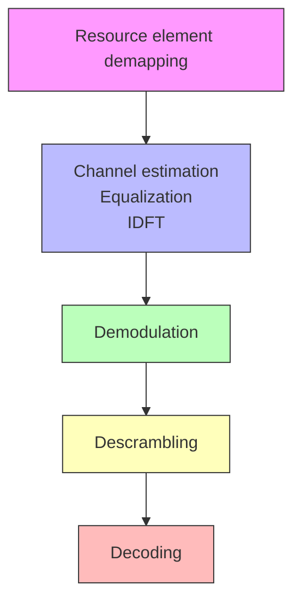

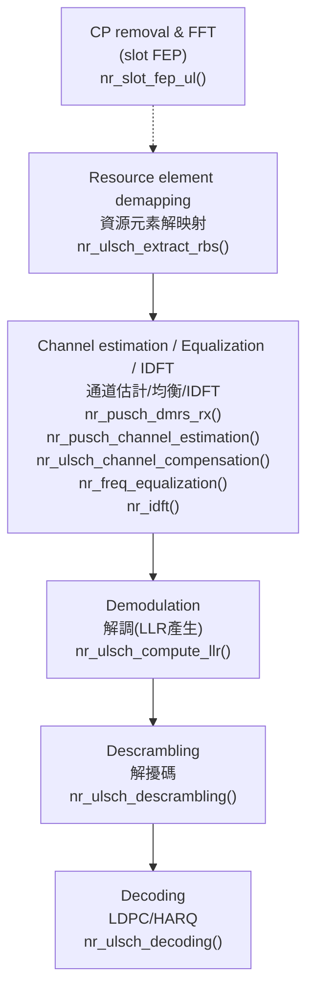
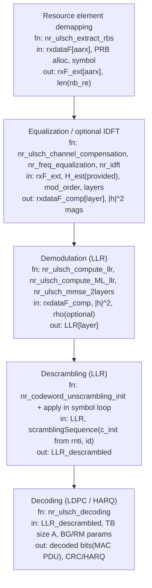

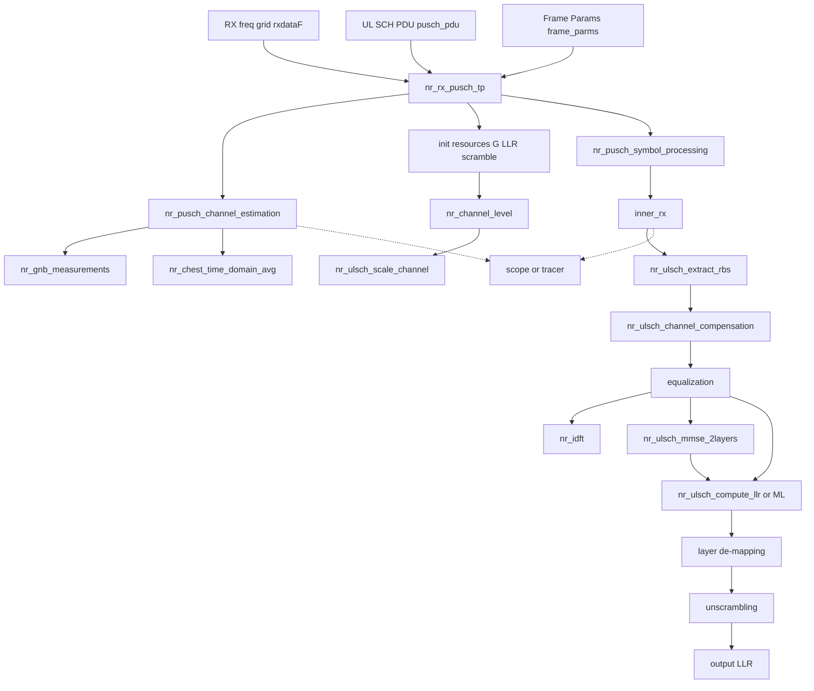

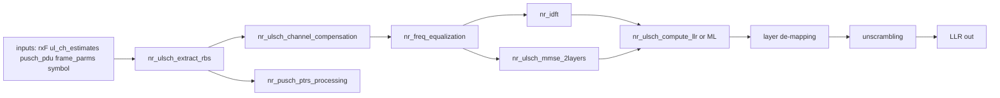

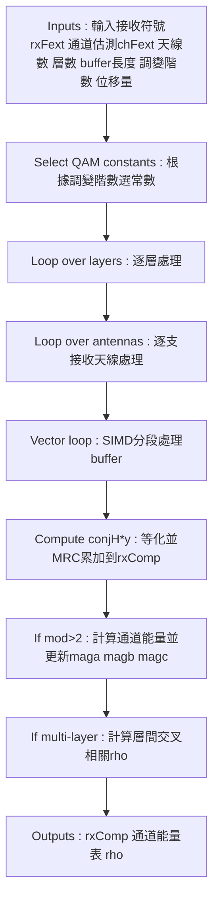
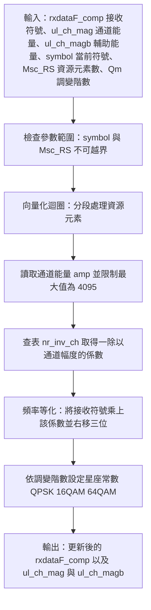

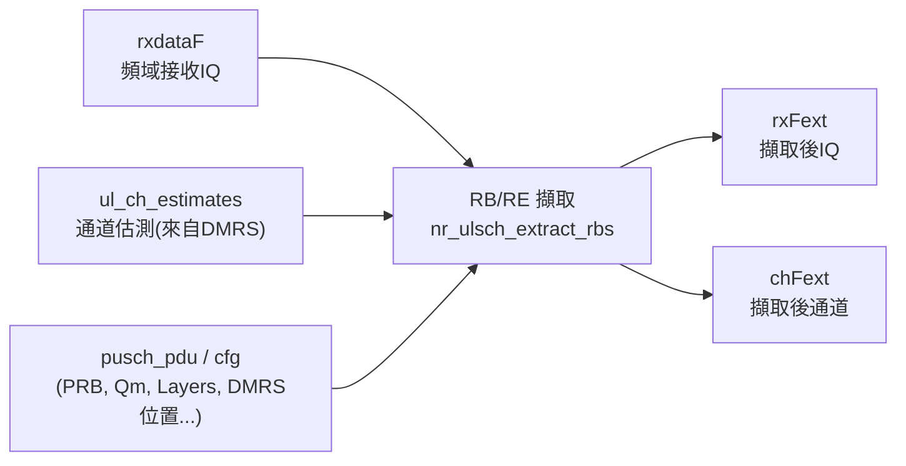
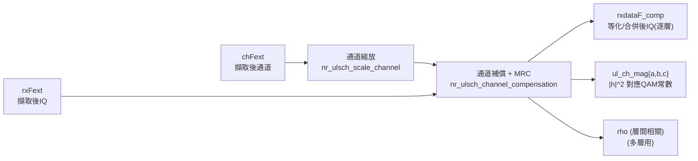
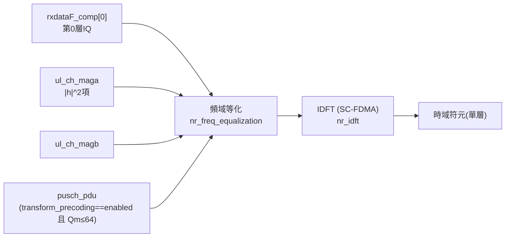
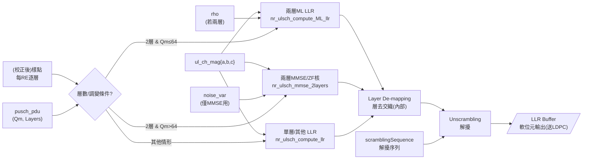
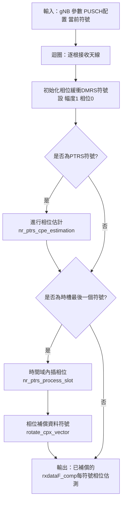

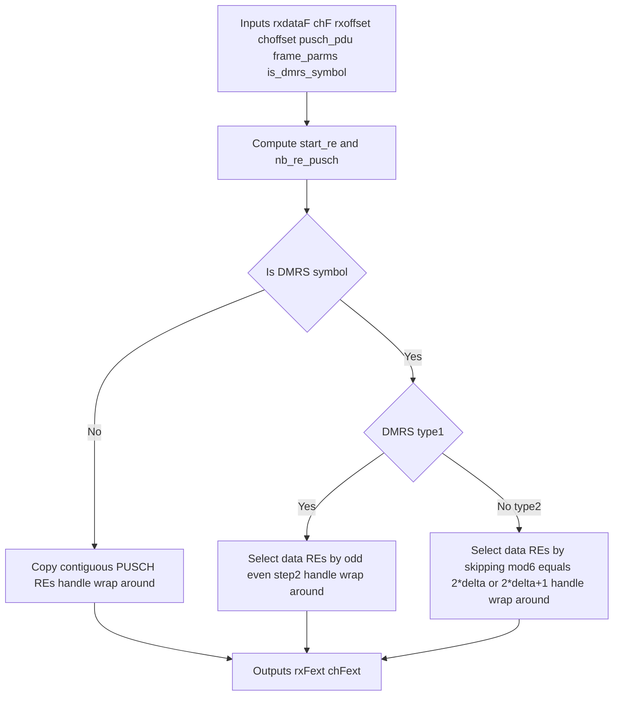
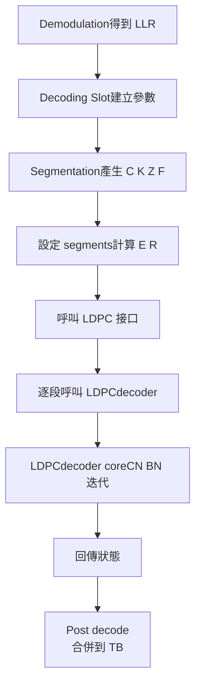
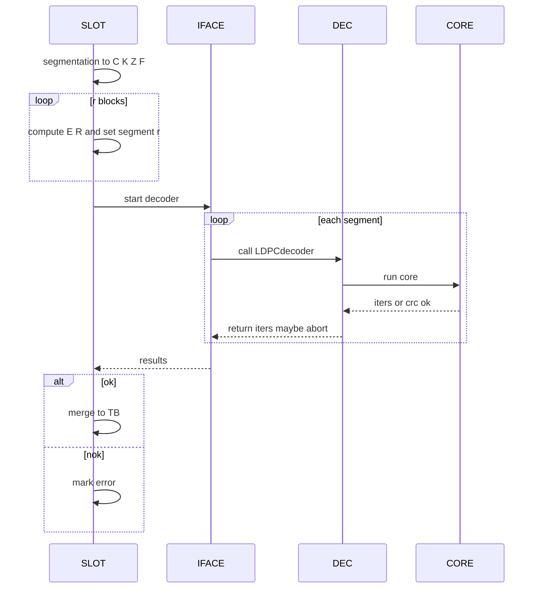
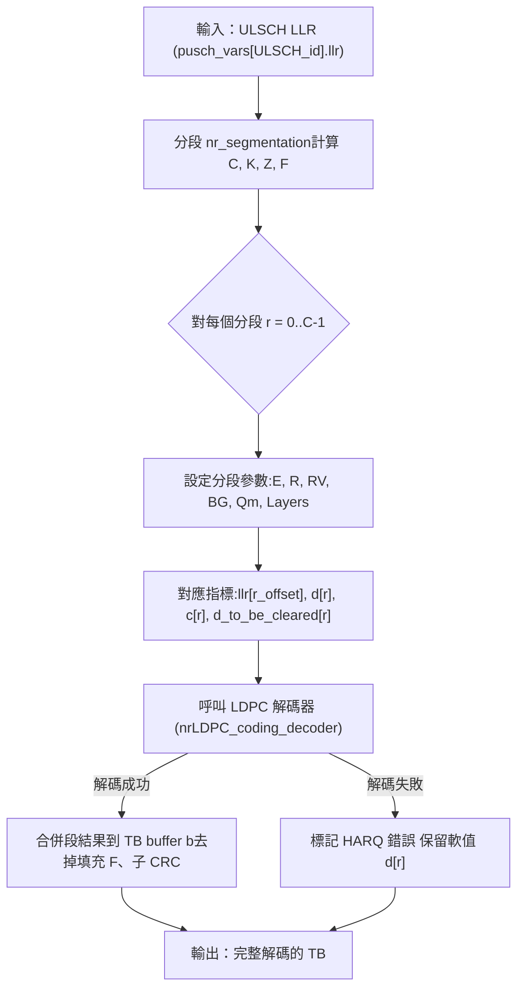
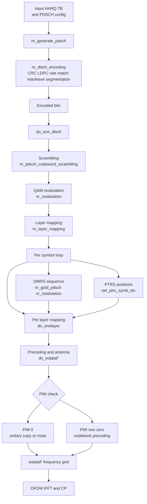
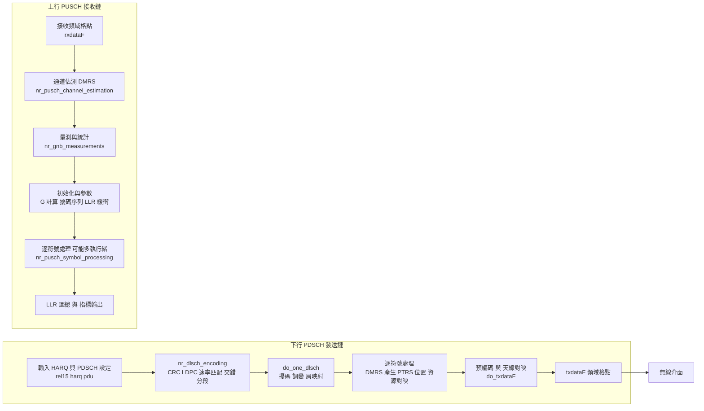

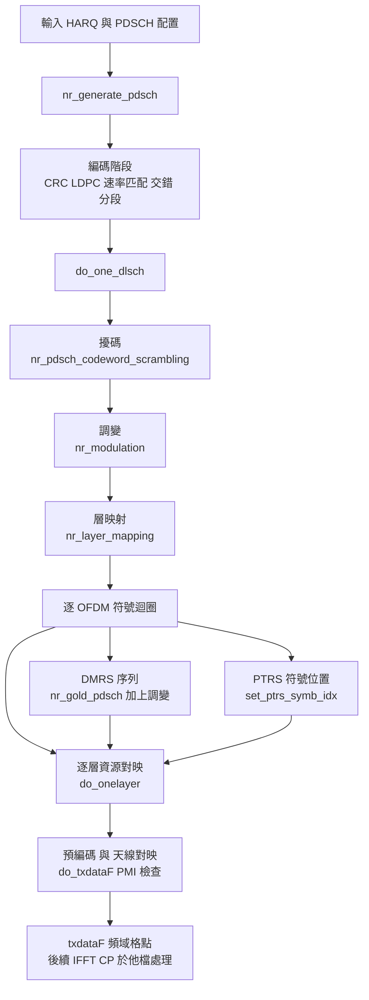

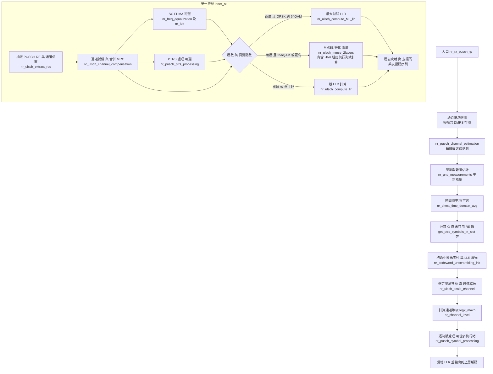

```mermaid
sequenceDiagram
  participant 調度器
  participant PDSCH編碼 as PDSCH編碼<br/>nr_dlsch_encoding
  participant 擾碼調變 as 擾碼 調變 層映射<br/>do_one_dlsch
  participant 對映 as 資源對映 DMRS PTRS<br/>do_onelayer do_ptrs_symbol dmrs_case00
  participant 預編碼 as 預編碼 天線對映<br/>do_txdataF
  participant 無線介面

  調度器->>PDSCH編碼: 呼叫 nr_generate_pdsch()
  PDSCH編碼->>PDSCH編碼: CRC LDPC 速率匹配 交錯 分段
  PDSCH編碼->>擾碼調變: 交付編碼後位元
  擾碼調變->>擾碼調變: 擾碼 nr_pdsch_codeword_scrambling<br/>調變 nr_modulation<br/>層映射 nr_layer_mapping
  擾碼調變->>對映: 逐符號處理
  對映->>預編碼: 交付各層頻域格點
  預編碼->>預編碼: PMI 檢查<br/>unitary 或 codebook<br/>nr_layer_precoder_simd / cm
  預編碼->>無線介面: 輸出 txdataF

```
