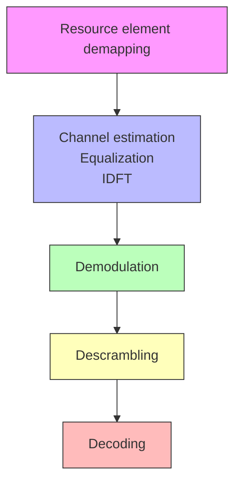
```mermaid
flowchart TB
    A[Resource element demapping] --> B[Channel estimation<br/>Equalization<br/>IDFT]
    B --> C[Demodulation]
    C --> D[Descrambling]
    D --> E[Decoding]

    style A fill:#f9f,stroke:#333,stroke-width:1px
    style B fill:#bbf,stroke:#333,stroke-width:1px
    style C fill:#bfb,stroke:#333,stroke-width:1px
    style D fill:#ffb,stroke:#333,stroke-width:1px
    style E fill:#fbb,stroke:#333,stroke-width:1px
```

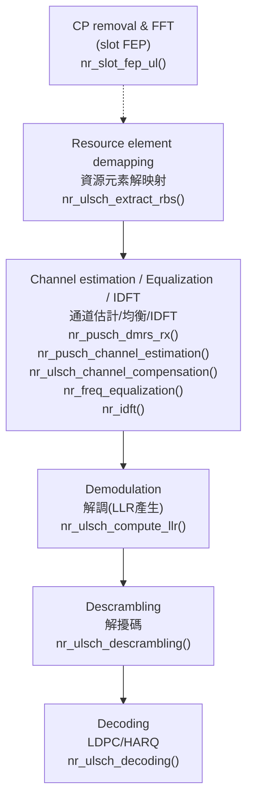
```mermaid
graph TD
P["CP removal & FFT\n(slot FEP)\nnr_slot_fep_ul()"] -.-> A

A["Resource element demapping\n資源元素解映射\nnr_ulsch_extract_rbs()"] --> 
B["Channel estimation / Equalization / IDFT\n通道估計/均衡/IDFT\nnr_pusch_dmrs_rx()\nnr_pusch_channel_estimation()\nnr_ulsch_channel_compensation()\nnr_freq_equalization()\nnr_idft()"] -->
C["Demodulation\n解調(LLR產生)\nnr_ulsch_compute_llr()"] -->
D["Descrambling\n解擾碼\nnr_ulsch_descrambling()"] -->
E["Decoding\nLDPC/HARQ\nnr_ulsch_decoding()"]


```
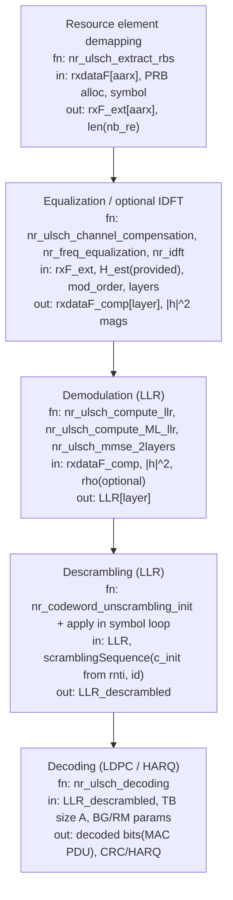
```mermaid
graph TD
A["Resource element demapping
fn: nr_ulsch_extract_rbs
in: rxdataF[aarx], PRB alloc, symbol
out: rxF_ext[aarx], len(nb_re)"] --> 
B["Equalization / optional IDFT
fn: nr_ulsch_channel_compensation, nr_freq_equalization, nr_idft
in: rxF_ext, H_est(provided), mod_order, layers
out: rxdataF_comp[layer], |h|^2 mags"] -->
C["Demodulation (LLR)
fn: nr_ulsch_compute_llr, nr_ulsch_compute_ML_llr, nr_ulsch_mmse_2layers
in: rxdataF_comp, |h|^2, rho(optional)
out: LLR[layer]"] -->
D["Descrambling (LLR)
fn: nr_codeword_unscrambling_init + apply in symbol loop
in: LLR, scramblingSequence(c_init from rnti, id)
out: LLR_descrambled"] -->
E["Decoding (LDPC / HARQ)
fn: nr_ulsch_decoding
in: LLR_descrambled, TB size A, BG/RM params
out: decoded bits(MAC PDU), CRC/HARQ"]
```

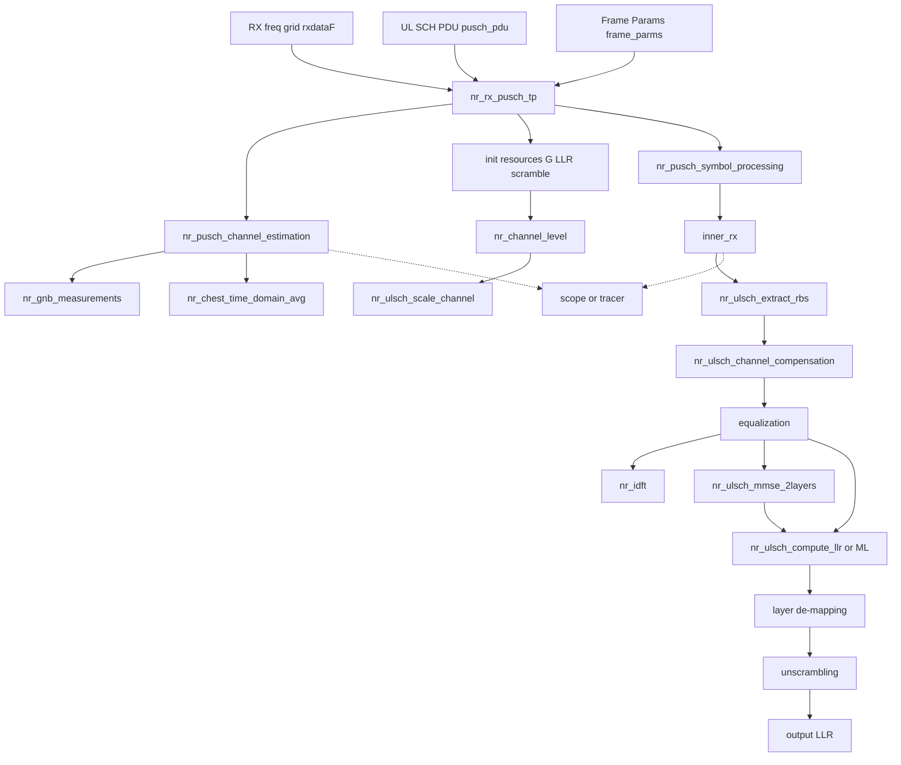
```mermaid
flowchart TD
  A[RX freq grid rxdataF]
  P[UL SCH PDU pusch_pdu]
  F[Frame Params frame_parms]

  NRTP[nr_rx_pusch_tp]
  CE[nr_pusch_channel_estimation]
  MEAS[nr_gnb_measurements]
  TDAVG[nr_chest_time_domain_avg]

  INIT[init resources G LLR scramble]
  CHLV[nr_channel_level]
  SCALE[nr_ulsch_scale_channel]

  SYM[nr_pusch_symbol_processing]
  IRX[inner_rx]

  EXTR[nr_ulsch_extract_rbs]
  COMP[nr_ulsch_channel_compensation]
  EQZ[equalization]
  IDFT[nr_idft]
  LLR1[nr_ulsch_compute_llr or ML]
  MMSE[nr_ulsch_mmse_2layers]
  DEMAP[layer de-mapping]
  UNSCR[unscrambling]
  OUTLLR[output LLR]
  SCOPE[scope or tracer]

  A --> NRTP
  P --> NRTP
  F --> NRTP

  NRTP --> CE
  CE --> MEAS
  CE --> TDAVG

  NRTP --> INIT
  INIT --> CHLV
  CHLV --> SCALE

  NRTP --> SYM
  SYM --> IRX
  IRX --> EXTR
  EXTR --> COMP
  COMP --> EQZ
  EQZ --> IDFT
  EQZ --> MMSE
  MMSE --> LLR1
  EQZ --> LLR1
  LLR1 --> DEMAP
  DEMAP --> UNSCR
  UNSCR --> OUTLLR

  IRX -.-> SCOPE
  CE -.-> SCOPE

```

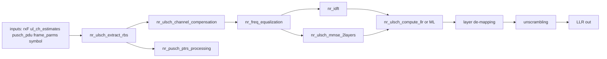
```mermaid
flowchart LR
  R0[inputs: rxF ul_ch_estimates pusch_pdu frame_parms symbol]
  E1[nr_ulsch_extract_rbs]
  C1[nr_ulsch_channel_compensation]
  C2[nr_freq_equalization]
  TP[nr_idft]
  ZFMMSE[nr_ulsch_mmse_2layers]
  L1[nr_ulsch_compute_llr or ML]
  DM[layer de-mapping]
  US[unscrambling]
  O1[LLR out]
  P1[nr_pusch_ptrs_processing]

  R0 --> E1
  E1 --> C1
  C1 --> C2
  C2 --> TP
  TP --> L1
  C2 --> ZFMMSE
  ZFMMSE --> L1
  L1 --> DM
  DM --> US
  US --> O1
  E1 --> P1
```

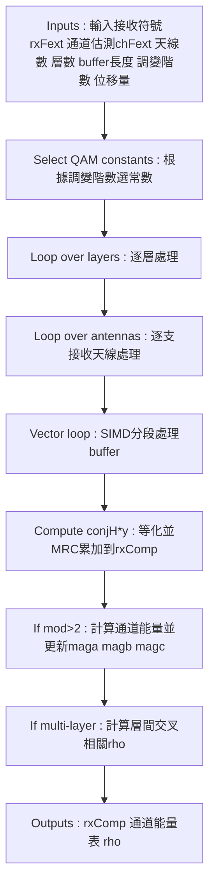
```mermaid
flowchart TD
  IN[Inputs : 輸入接收符號rxFext 通道估測chFext 天線數 層數 buffer長度 調變階數 位移量]
  QAM[Select QAM constants : 根據調變階數選常數]
  L[Loop over layers : 逐層處理]
  A[Loop over antennas : 逐支接收天線處理]
  V[Vector loop : SIMD分段處理buffer]
  MRC[Compute conjH*y : 等化並MRC累加到rxComp]
  MAG[If mod>2 : 計算通道能量並更新maga magb magc]
  RHO[If multi-layer : 計算層間交叉相關rho]
  OUT[Outputs : rxComp 通道能量表 rho]

  IN --> QAM --> L --> A --> V --> MRC --> MAG --> RHO --> OUT

```
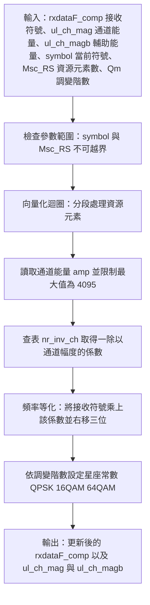
```mermaid
flowchart TD
  IN[輸入：rxdataF_comp 接收符號、ul_ch_mag 通道能量、ul_ch_magb 輔助能量、symbol 當前符號、Msc_RS 資源元素數、Qm 調變階數]
  CK[檢查參數範圍：symbol 與 Msc_RS 不可越界]
  LOOP[向量化迴圈：分段處理資源元素]
  AMP[讀取通道能量 amp 並限制最大值為 4095]
  INV[查表 nr_inv_ch 取得一除以通道幅度的係數]
  EQ[頻率等化：將接收符號乘上該係數並右移三位]
  CONST[依調變階數設定星座常數 QPSK 16QAM 64QAM]
  OUT[輸出：更新後的 rxdataF_comp 以及 ul_ch_mag 與 ul_ch_magb]

  IN --> CK --> LOOP --> AMP --> INV --> EQ --> CONST --> OUT


```

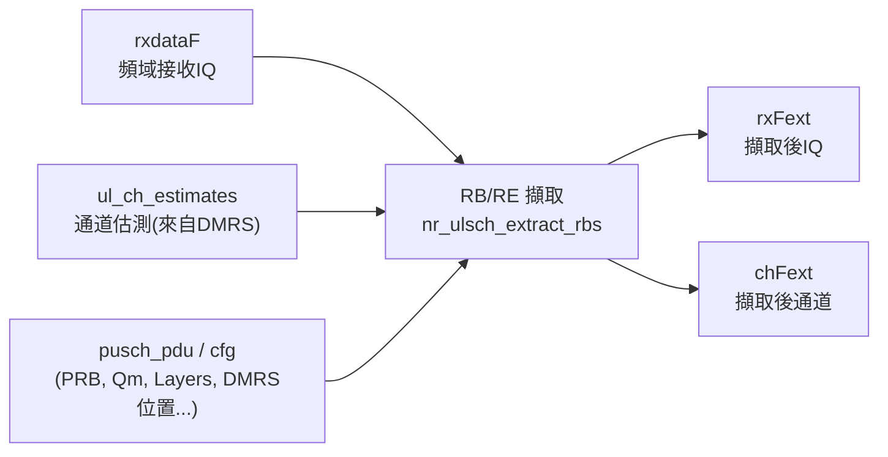
```mermaid
flowchart LR
  RX["rxdataF\n頻域接收IQ"]
  CHEST["ul_ch_estimates\n通道估測(來自DMRS)"]
  PDU["pusch_pdu / cfg\n(PRB, Qm, Layers, DMRS位置...)"]

  EXTRACT["RB/RE 擷取\nnr_ulsch_extract_rbs"]

  RX --> EXTRACT
  CHEST --> EXTRACT
  PDU --> EXTRACT

  EXTRACT --> RXFEXT["rxFext\n擷取後IQ"]
  EXTRACT --> CHFEXT["chFext\n擷取後通道"]

```
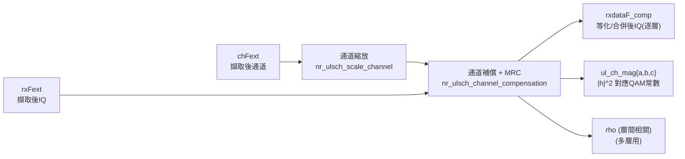
```mermaid
flowchart LR
  CHFEXT["chFext\n擷取後通道"]
  RXFEXT["rxFext\n擷取後IQ"]

  SCALE["通道縮放\nnr_ulsch_scale_channel"]
  COMP["通道補償 + MRC\nnr_ulsch_channel_compensation"]

  CHFEXT --> SCALE --> COMP
  RXFEXT ----------> COMP

  COMP --> RXCOMP["rxdataF_comp\n等化/合併後IQ(逐層)"]
  COMP --> MAGA["ul_ch_mag{a,b,c}\n|h|^2 對應QAM常數"]
  COMP --> RHO["rho (層間相關)\n(多層用)"]
```
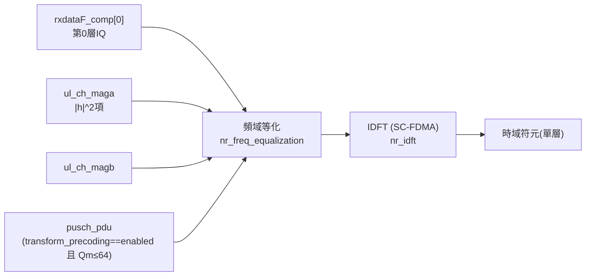
```mermaid
flowchart LR
  RXCOMP["rxdataF_comp[0]\n第0層IQ"]
  MAGA["ul_ch_maga\n|h|^2項"]
  MAGB["ul_ch_magb"]
  CFG["pusch_pdu\n(transform_precoding==enabled 且 Qm≤64)"]

  FEQ["頻域等化\nnr_freq_equalization"]
  IDFT["IDFT (SC-FDMA)\nnr_idft"]

  RXCOMP --> FEQ --> IDFT
  MAGA --> FEQ
  MAGB --> FEQ
  CFG  --> FEQ

  IDFT --> TD["時域符元(單層)"]
```
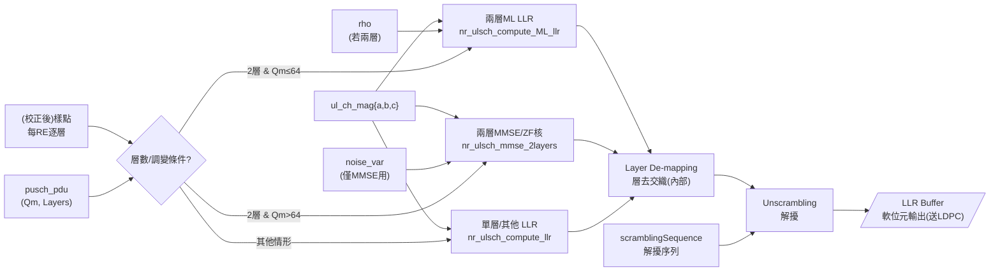
```mermaid
flowchart LR
  IQ["(校正後)樣點\n每RE逐層"]
  MAG["ul_ch_mag{a,b,c}"]
  RHO["rho\n(若兩層)"]
  NVAR["noise_var\n(僅MMSE用)"]
  CFG["pusch_pdu\n(Qm, Layers)"]
  SCRAM["scramblingSequence\n解擾序列"]

  DECIDE{"層數/調變條件?"}

  ML["兩層ML LLR\nnr_ulsch_compute_ML_llr"]
  MMSE["兩層MMSE/ZF核\nnr_ulsch_mmse_2layers"]
  LLR1["單層/其他 LLR\nnr_ulsch_compute_llr"]

  LDMAP["Layer De-mapping\n層去交織(內部)"]
  UNSCR["Unscrambling\n解擾"]

  IQ --> DECIDE
  MAG --> ML
  MAG --> MMSE
  MAG --> LLR1
  RHO --> ML
  NVAR --> MMSE
  CFG --> DECIDE

  DECIDE -- "2層 & Qm≤64" --> ML --> LDMAP
  DECIDE -- "2層 & Qm>64" --> MMSE --> LDMAP
  DECIDE -- "其他情形" ----> LLR1 --> LDMAP

  LDMAP --> UNSCR --> LLRBUF[/"LLR Buffer\n軟位元輸出(送LDPC)"/]
  SCRAM --> UNSCR
```
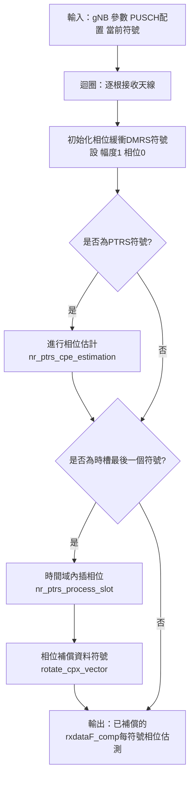
```mermaid
flowchart TD
  IN[輸入：gNB 參數 PUSCH配置 當前符號]
  LOOPA[迴圈：逐根接收天線]
  INIT[初始化相位緩衝DMRS符號設 幅度1 相位0]
  PTRSCHECK{是否為PTRS符號?}
  EST[進行相位估計nr_ptrs_cpe_estimation]
  LASTCHECK{是否為時槽最後一個符號?}
  INTERP[時間域內插相位nr_ptrs_process_slot]
  ROTATE[相位補償資料符號rotate_cpx_vector]
  OUT[輸出：已補償的rxdataF_comp每符號相位估測]

  IN --> LOOPA --> INIT --> PTRSCHECK
  PTRSCHECK -->|是| EST --> LASTCHECK
  PTRSCHECK -->|否| LASTCHECK
  LASTCHECK -->|是| INTERP --> ROTATE --> OUT
  LASTCHECK -->|否| OUT

```

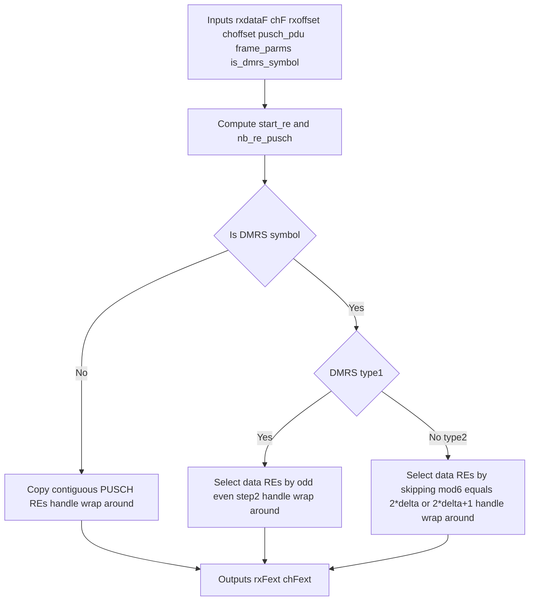
```mermaid
flowchart TD
  IN[Inputs rxdataF chF rxoffset choffset pusch_pdu frame_parms is_dmrs_symbol]
  SR[Compute start_re and nb_re_pusch]
  DCHK{Is DMRS symbol}
  D0[Copy contiguous PUSCH REs handle wrap around]
  T1{DMRS type1}
  T1SEL[Select data REs by odd even step2 handle wrap around]
  T2SEL[Select data REs by skipping mod6 equals 2*delta or 2*delta+1 handle wrap around]
  OUT[Outputs rxFext chFext]

  IN --> SR --> DCHK
  DCHK -->|No| D0 --> OUT
  DCHK -->|Yes| T1
  T1 -->|Yes| T1SEL --> OUT
  T1 -->|No  type2| T2SEL --> OUT

```
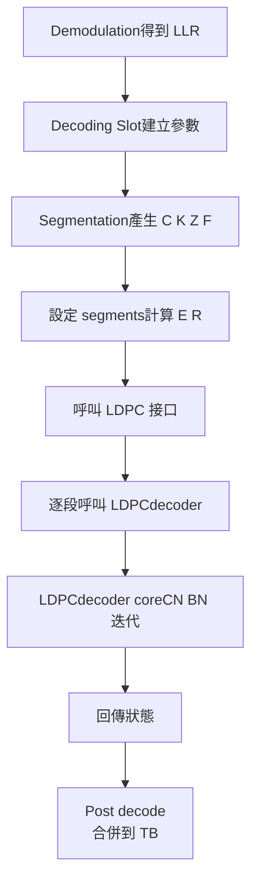
```mermaid
flowchart TD
  A[Demodulation得到 LLR] --> B[Decoding Slot建立參數]
  B --> C[Segmentation產生 C K Z F]
  C --> D[設定 segments計算 E R]
  D --> E[呼叫 LDPC 接口]
  E --> F[逐段呼叫 LDPCdecoder]
  F --> G[LDPCdecoder coreCN BN 迭代]
  G --> H[回傳狀態]
  H --> I[Post decode\n合併到 TB]


```
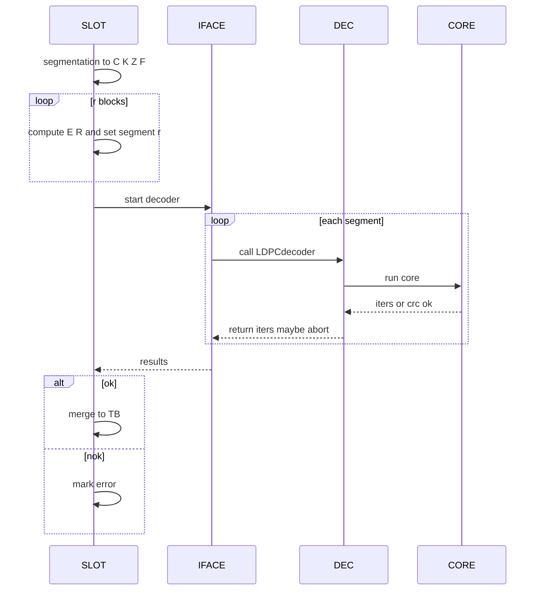
```mermaid
sequenceDiagram
  participant SLOT
  participant IFACE
  participant DEC
  participant CORE

  SLOT->>SLOT: segmentation to C K Z F
  loop r blocks
    SLOT->>SLOT: compute E R and set segment r
  end
  SLOT->>IFACE: start decoder

  loop each segment
    IFACE->>DEC: call LDPCdecoder
    DEC->>CORE: run core
    CORE-->>DEC: iters or crc ok
    DEC-->>IFACE: return iters maybe abort
  end

  IFACE-->>SLOT: results
  alt ok
    SLOT->>SLOT: merge to TB
  else nok
    SLOT->>SLOT: mark error
  end

```
